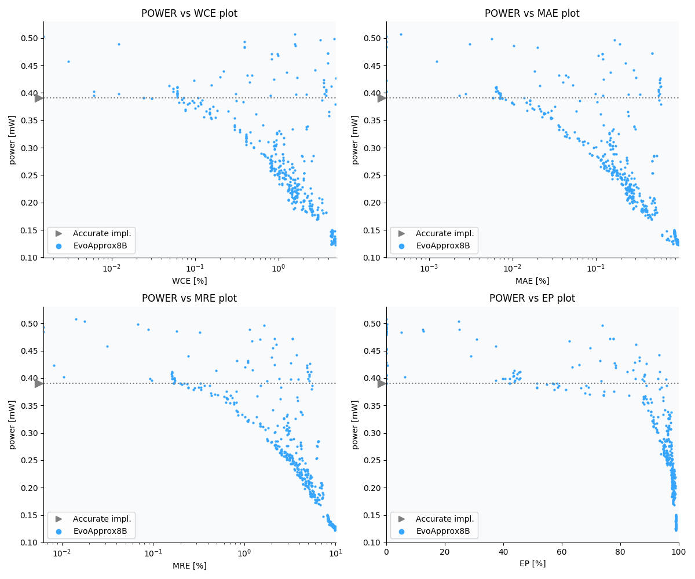

8-bit unsigned multiplier
==================
## The library was replaced by new version.
The new version can be found on [our websites](https://ehw.fit.vutbr.cz/evoapprox)

## Reference
This library is licenced under [MIT licence](LICENCE.md). If you use the library in your research, please refer the following paper:

V. Mrazek, R. Hrbacek, Z. Vasicek and L. Sekanina, EvoApprox8b: Library of approximate adders and multipliers for circuit design and benchmarking of approximation methods. Design, Automation & Test in Europe Conference & Exhibition (DATE), 2017, Lausanne, 2017, pp. 258-261. doi: [10.23919/DATE.2017.7926993](https://dx.doi.org/10.23919/DATE.2017.7926993) 

```bibtex
@INPROCEEDINGS{evoapprox16,
    author={V. Mrazek and R. Hrbacek and Z. Vasicek and L. Sekanina}, 
    booktitle={Design, Automation Test in Europe Conference Exhibition (DATE), 2017}, 
    title={EvoApprox8b: Library of approximate adders and multipliers for circuit design and benchmarking of approximation methods}, 
    year={2017}, 
    volume={}, 
    number={}, 
    pages={258-261}, 
    doi={10.23919/DATE.2017.7926993}, 
    ISSN={1558-1101}, 
    month={March},}
```

 

Description
----------------------------
A library of approximate and initial (accurate) arithmetic circuits. The circuits were pareto-optimized for Power, Area and MRE.
 - MAE - mean absolute error
 - MSE - mean squared error
 - MRE - mean relative error
 - WCE - worst case error
 - WCRE - worst case relative error
 - VAE - variance of absolute error
 - EP - error probability

Parameters of selected circuits
----------------------------

| Circuit name | MAE<sub>%</sub> | WCE<sub>%</sub> | EP<sub>%</sub> | MRE<sub>%</sub> | MSE | Download |
| --- |  --- | --- | --- | --- | --- | --- | 
| mul8_006 | 0.00046 | 1.56 | 0.026 | 0.014 | 272 |  [[Verilog](source_v/mul8_006.v)] [[Verilog<sub>PDK45</sub>](source_v/mul8_006_pdk45.v)] [[C](source_c/mul8_006.c)] [[Matlab](source_m/mul8_006.m)] |
| mul8_455 | 0.00031 | 0.0015 | 24.80 | 0.018 | 0.2 |  [[Verilog](source_v/mul8_455.v)] [[Verilog<sub>PDK45</sub>](source_v/mul8_455_pdk45.v)] [[C](source_c/mul8_455.c)] [[Matlab](source_m/mul8_455.m)] |
| mul8_109 | 0.0056 | 4.69 | 0.30 | 0.068 | 5760 |  [[Verilog](source_v/mul8_109.v)] [[Verilog<sub>PDK45</sub>](source_v/mul8_109_pdk45.v)] [[C](source_c/mul8_109.c)] [[Matlab](source_m/mul8_109.m)] |
| mul8_103 | 0.17 | 3.16 | 73.86 | 1.65 | 96500 |  [[Verilog](source_v/mul8_103.v)] [[Verilog<sub>PDK45</sub>](source_v/mul8_103_pdk45.v)] [[C](source_c/mul8_103.c)] [[Matlab](source_m/mul8_103.m)] |
| mul8_142 | 0.00 | 0.00 | 0.00 | 0.00 | 0 |  [[Verilog](source_v/mul8_142.v)] [[Verilog<sub>PDK45</sub>](source_v/mul8_142_pdk45.v)] [[C](source_c/mul8_142.c)] [[Matlab](source_m/mul8_142.m)] |
| mul8_400 | 0.00031 | 0.39 | 0.098 | 0.0063 | 64 |  [[Verilog](source_v/mul8_400.v)] [[Verilog<sub>PDK45</sub>](source_v/mul8_400_pdk45.v)] [[C](source_c/mul8_400.c)] [[Matlab](source_m/mul8_400.m)] |
| mul8_351 | 0.00 | 0.00 | 0.00 | 0.00 | 0 |  [[Verilog](source_v/mul8_351.v)] [[Verilog<sub>PDK45</sub>](source_v/mul8_351_pdk45.v)] [[C](source_c/mul8_351.c)] [[Matlab](source_m/mul8_351.m)] |
| mul8_141 | 0.00 | 0.00 | 0.00 | 0.00 | 0 |  [[Verilog](source_v/mul8_141.v)] [[Verilog<sub>PDK45</sub>](source_v/mul8_141_pdk45.v)] [[C](source_c/mul8_141.c)] [[Matlab](source_m/mul8_141.m)] |
| mul8_314 | 0.00 | 0.00 | 0.00 | 0.00 | 0 |  [[Verilog](source_v/mul8_314.v)] [[Verilog<sub>PDK45</sub>](source_v/mul8_314_pdk45.v)] [[C](source_c/mul8_314.c)] [[Matlab](source_m/mul8_314.m)] |
| mul8_086 | 0.00 | 0.00 | 0.00 | 0.00 | 0 |  [[Verilog](source_v/mul8_086.v)] [[Verilog<sub>PDK45</sub>](source_v/mul8_086_pdk45.v)] [[C](source_c/mul8_086.c)] [[Matlab](source_m/mul8_086.m)] |
| mul8_177 | 0.00 | 0.00 | 0.00 | 0.00 | 0 |  [[Verilog](source_v/mul8_177.v)] [[Verilog<sub>PDK45</sub>](source_v/mul8_177_pdk45.v)] [[C](source_c/mul8_177.c)] [[Matlab](source_m/mul8_177.m)] |
| mul8_240 | 0.00 | 0.00 | 0.00 | 0.00 | 0 |  [[Verilog](source_v/mul8_240.v)] [[Verilog<sub>PDK45</sub>](source_v/mul8_240_pdk45.v)] [[C](source_c/mul8_240.c)] [[Matlab](source_m/mul8_240.m)] |
| mul8_087 | 0.00 | 0.00 | 0.00 | 0.00 | 0 |  [[Verilog](source_v/mul8_087.v)] [[Verilog<sub>PDK45</sub>](source_v/mul8_087_pdk45.v)] [[C](source_c/mul8_087.c)] [[Matlab](source_m/mul8_087.m)] |
| mul8_041 | 0.00 | 0.00 | 0.00 | 0.00 | 0 |  [[Verilog](source_v/mul8_041.v)] [[Verilog<sub>PDK45</sub>](source_v/mul8_041_pdk45.v)] [[C](source_c/mul8_041.c)] [[Matlab](source_m/mul8_041.m)] |
| mul8_263 | 0.0031 | 0.012 | 25.00 | 0.089 | 16 |  [[Verilog](source_v/mul8_263.v)] [[Verilog<sub>PDK45</sub>](source_v/mul8_263_pdk45.v)] [[C](source_c/mul8_263.c)] [[Matlab](source_m/mul8_263.m)] |
| mul8_453 | 0.20 | 1.56 | 12.50 | 1.15 | 131072 |  [[Verilog](source_v/mul8_453.v)] [[Verilog<sub>PDK45</sub>](source_v/mul8_453_pdk45.v)] [[C](source_c/mul8_453.c)] [[Matlab](source_m/mul8_453.m)] |
| mul8_398 | 0.01 | 1.61 | 12.76 | 0.18 | 2961 |  [[Verilog](source_v/mul8_398.v)] [[Verilog<sub>PDK45</sub>](source_v/mul8_398_pdk45.v)] [[C](source_c/mul8_398.c)] [[Matlab](source_m/mul8_398.m)] |
| mul8_206 | 0.00 | 0.00 | 0.00 | 0.00 | 0 |  [[Verilog](source_v/mul8_206.v)] [[Verilog<sub>PDK45</sub>](source_v/mul8_206_pdk45.v)] [[C](source_c/mul8_206.c)] [[Matlab](source_m/mul8_206.m)] |
| mul8_357 | 0.00 | 0.00 | 0.00 | 0.00 | 0 |  [[Verilog](source_v/mul8_357.v)] [[Verilog<sub>PDK45</sub>](source_v/mul8_357_pdk45.v)] [[C](source_c/mul8_357.c)] [[Matlab](source_m/mul8_357.m)] |
| mul8_248 | 0.00 | 0.00 | 0.00 | 0.00 | 0 |  [[Verilog](source_v/mul8_248.v)] [[Verilog<sub>PDK45</sub>](source_v/mul8_248_pdk45.v)] [[C](source_c/mul8_248.c)] [[Matlab](source_m/mul8_248.m)] |
| mul8_344 | 0.00 | 0.00 | 0.00 | 0.00 | 0 |  [[Verilog](source_v/mul8_344.v)] [[Verilog<sub>PDK45</sub>](source_v/mul8_344_pdk45.v)] [[C](source_c/mul8_344.c)] [[Matlab](source_m/mul8_344.m)] |
| mul8_318 | 0.00031 | 0.39 | 0.098 | 0.0063 | 64 |  [[Verilog](source_v/mul8_318.v)] [[Verilog<sub>PDK45</sub>](source_v/mul8_318_pdk45.v)] [[C](source_c/mul8_318.c)] [[Matlab](source_m/mul8_318.m)] |
| mul8_016 | 0.02 | 0.39 | 5.08 | 0.33 | 3328 |  [[Verilog](source_v/mul8_016.v)] [[Verilog<sub>PDK45</sub>](source_v/mul8_016_pdk45.v)] [[C](source_c/mul8_016.c)] [[Matlab](source_m/mul8_016.m)] |
| mul8_012 | 0.00 | 0.00 | 0.00 | 0.00 | 0 |  [[Verilog](source_v/mul8_012.v)] [[Verilog<sub>PDK45</sub>](source_v/mul8_012_pdk45.v)] [[C](source_c/mul8_012.c)] [[Matlab](source_m/mul8_012.m)] |
| mul8_235 | 0.00 | 0.00 | 0.00 | 0.00 | 0 |  [[Verilog](source_v/mul8_235.v)] [[Verilog<sub>PDK45</sub>](source_v/mul8_235_pdk45.v)] [[C](source_c/mul8_235.c)] [[Matlab](source_m/mul8_235.m)] |
| mul8_153 | 0.00 | 0.00 | 0.00 | 0.00 | 0 |  [[Verilog](source_v/mul8_153.v)] [[Verilog<sub>PDK45</sub>](source_v/mul8_153_pdk45.v)] [[C](source_c/mul8_153.c)] [[Matlab](source_m/mul8_153.m)] |
| mul8_407 | 0.00 | 0.00 | 0.00 | 0.00 | 0 |  [[Verilog](source_v/mul8_407.v)] [[Verilog<sub>PDK45</sub>](source_v/mul8_407_pdk45.v)] [[C](source_c/mul8_407.c)] [[Matlab](source_m/mul8_407.m)] |
| mul8_070 | 0.00 | 0.00 | 0.00 | 0.00 | 0 |  [[Verilog](source_v/mul8_070.v)] [[Verilog<sub>PDK45</sub>](source_v/mul8_070_pdk45.v)] [[C](source_c/mul8_070.c)] [[Matlab](source_m/mul8_070.m)] |
| mul8_239 | 0.47 | 3.92 | 77.72 | 3.38 | 326417 |  [[Verilog](source_v/mul8_239.v)] [[Verilog<sub>PDK45</sub>](source_v/mul8_239_pdk45.v)] [[C](source_c/mul8_239.c)] [[Matlab](source_m/mul8_239.m)] |
| mul8_052 | 0.47 | 3.92 | 77.74 | 3.39 | 327303 |  [[Verilog](source_v/mul8_052.v)] [[Verilog<sub>PDK45</sub>](source_v/mul8_052_pdk45.v)] [[C](source_c/mul8_052.c)] [[Matlab](source_m/mul8_052.m)] |
| mul8_394 | 0.12 | 0.83 | 76.42 | 2.15 | 11907 |  [[Verilog](source_v/mul8_394.v)] [[Verilog<sub>PDK45</sub>](source_v/mul8_394_pdk45.v)] [[C](source_c/mul8_394.c)] [[Matlab](source_m/mul8_394.m)] |
| mul8_136 | 0.12 | 0.98 | 30.88 | 1.50 | 21642 |  [[Verilog](source_v/mul8_136.v)] [[Verilog<sub>PDK45</sub>](source_v/mul8_136_pdk45.v)] [[C](source_c/mul8_136.c)] [[Matlab](source_m/mul8_136.m)] |
| mul8_007 | 0.11 | 0.99 | 62.54 | 1.22 | 15012 |  [[Verilog](source_v/mul8_007.v)] [[Verilog<sub>PDK45</sub>](source_v/mul8_007_pdk45.v)] [[C](source_c/mul8_007.c)] [[Matlab](source_m/mul8_007.m)] |
| mul8_277 | 0.12 | 0.83 | 85.44 | 2.25 | 12091 |  [[Verilog](source_v/mul8_277.v)] [[Verilog<sub>PDK45</sub>](source_v/mul8_277_pdk45.v)] [[C](source_c/mul8_277.c)] [[Matlab](source_m/mul8_277.m)] |
| mul8_132 | 0.0012 | 0.0031 | 37.50 | 0.032 | 1.5 |  [[Verilog](source_v/mul8_132.v)] [[Verilog<sub>PDK45</sub>](source_v/mul8_132_pdk45.v)] [[C](source_c/mul8_132.c)] [[Matlab](source_m/mul8_132.m)] |
| mul8_491 | 0.23 | 3.92 | 69.82 | 2.07 | 99610 |  [[Verilog](source_v/mul8_491.v)] [[Verilog<sub>PDK45</sub>](source_v/mul8_491_pdk45.v)] [[C](source_c/mul8_491.c)] [[Matlab](source_m/mul8_491.m)] |
| mul8_WTM_CSA | 0.00 | 0.00 | 0.00 | 0.00 | 0 |  [[Verilog](source_v/mul8_WallaceTreeMultiplier_Using_CarrySelectAdder.v)] [[Verilog<sub>PDK45</sub>](source_v/mul8_WallaceTreeMultiplier_Using_CarrySelectAdder_pdk45.v)] [[C](source_c/mul8_WallaceTreeMultiplier_Using_CarrySelectAdder.c)] [[Matlab](source_m/mul8_WallaceTreeMultiplier_Using_CarrySelectAdder.m)] |
| mul8_289 | 0.00 | 0.00 | 0.00 | 0.00 | 0 |  [[Verilog](source_v/mul8_289.v)] [[Verilog<sub>PDK45</sub>](source_v/mul8_289_pdk45.v)] [[C](source_c/mul8_289.c)] [[Matlab](source_m/mul8_289.m)] |
| mul8_282 | 0.00 | 0.00 | 0.00 | 0.00 | 0 |  [[Verilog](source_v/mul8_282.v)] [[Verilog<sub>PDK45</sub>](source_v/mul8_282_pdk45.v)] [[C](source_c/mul8_282.c)] [[Matlab](source_m/mul8_282.m)] |
| mul8_484 | 0.00 | 0.00 | 0.00 | 0.00 | 0 |  [[Verilog](source_v/mul8_484.v)] [[Verilog<sub>PDK45</sub>](source_v/mul8_484_pdk45.v)] [[C](source_c/mul8_484.c)] [[Matlab](source_m/mul8_484.m)] |
| mul8_WTM_CLA | 0.00 | 0.00 | 0.00 | 0.00 | 0 |  [[Verilog](source_v/mul8_WallaceTreeMultiplier_Using_CarryLookaheadAdder.v)] [[Verilog<sub>PDK45</sub>](source_v/mul8_WallaceTreeMultiplier_Using_CarryLookaheadAdder_pdk45.v)] [[C](source_c/mul8_WallaceTreeMultiplier_Using_CarryLookaheadAdder.c)] [[Matlab](source_m/mul8_WallaceTreeMultiplier_Using_CarryLookaheadAdder.m)] |
| mul8_026 | 0.28 | 2.75 | 93.25 | 3.77 | 124504 |  [[Verilog](source_v/mul8_026.v)] [[Verilog<sub>PDK45</sub>](source_v/mul8_026_pdk45.v)] [[C](source_c/mul8_026.c)] [[Matlab](source_m/mul8_026.m)] |
| mul8_463 | 0.018 | 0.22 | 28.91 | 0.24 | 1184 |  [[Verilog](source_v/mul8_463.v)] [[Verilog<sub>PDK45</sub>](source_v/mul8_463_pdk45.v)] [[C](source_c/mul8_463.c)] [[Matlab](source_m/mul8_463.m)] |
| mul8_000 | 0.15 | 1.25 | 86.49 | 2.00 | 27520 |  [[Verilog](source_v/mul8_000.v)] [[Verilog<sub>PDK45</sub>](source_v/mul8_000_pdk45.v)] [[C](source_c/mul8_000.c)] [[Matlab](source_m/mul8_000.m)] |
| mul8_442 | 0.036 | 0.48 | 86.66 | 0.83 | 2705 |  [[Verilog](source_v/mul8_442.v)] [[Verilog<sub>PDK45</sub>](source_v/mul8_442_pdk45.v)] [[C](source_c/mul8_442.c)] [[Matlab](source_m/mul8_442.m)] |
| mul8_035 | 0.044 | 0.43 | 73.16 | 1.10 | 3334 |  [[Verilog](source_v/mul8_035.v)] [[Verilog<sub>PDK45</sub>](source_v/mul8_035_pdk45.v)] [[C](source_c/mul8_035.c)] [[Matlab](source_m/mul8_035.m)] |
| mul8_076 | 0.046 | 0.20 | 84.96 | 1.10 | 1713 |  [[Verilog](source_v/mul8_076.v)] [[Verilog<sub>PDK45</sub>](source_v/mul8_076_pdk45.v)] [[C](source_c/mul8_076.c)] [[Matlab](source_m/mul8_076.m)] |
| mul8_021 | 0.00 | 0.00 | 0.00 | 0.00 | 0 |  [[Verilog](source_v/mul8_021.v)] [[Verilog<sub>PDK45</sub>](source_v/mul8_021_pdk45.v)] [[C](source_c/mul8_021.c)] [[Matlab](source_m/mul8_021.m)] |
| mul8_031 | 0.30 | 1.67 | 78.04 | 3.21 | 182870 |  [[Verilog](source_v/mul8_031.v)] [[Verilog<sub>PDK45</sub>](source_v/mul8_031_pdk45.v)] [[C](source_c/mul8_031.c)] [[Matlab](source_m/mul8_031.m)] |
| mul8_037 | 0.60 | 4.89 | 88.92 | 5.21 | 503582 |  [[Verilog](source_v/mul8_037.v)] [[Verilog<sub>PDK45</sub>](source_v/mul8_037_pdk45.v)] [[C](source_c/mul8_037.c)] [[Matlab](source_m/mul8_037.m)] |
| mul8_080 | 0.12 | 0.88 | 66.04 | 2.15 | 28190 |  [[Verilog](source_v/mul8_080.v)] [[Verilog<sub>PDK45</sub>](source_v/mul8_080_pdk45.v)] [[C](source_c/mul8_080.c)] [[Matlab](source_m/mul8_080.m)] |
| mul8_299 | 0.00 | 0.00 | 0.00 | 0.00 | 0 |  [[Verilog](source_v/mul8_299.v)] [[Verilog<sub>PDK45</sub>](source_v/mul8_299_pdk45.v)] [[C](source_c/mul8_299.c)] [[Matlab](source_m/mul8_299.m)] |
| mul8_244 | 0.59 | 3.50 | 78.49 | 4.84 | 528242 |  [[Verilog](source_v/mul8_244.v)] [[Verilog<sub>PDK45</sub>](source_v/mul8_244_pdk45.v)] [[C](source_c/mul8_244.c)] [[Matlab](source_m/mul8_244.m)] |
| mul8_348 | 0.00031 | 0.098 | 0.39 | 0.0082 | 16 |  [[Verilog](source_v/mul8_348.v)] [[Verilog<sub>PDK45</sub>](source_v/mul8_348_pdk45.v)] [[C](source_c/mul8_348.c)] [[Matlab](source_m/mul8_348.m)] |
| mul8_027 | 0.00 | 0.00 | 0.00 | 0.00 | 0 |  [[Verilog](source_v/mul8_027.v)] [[Verilog<sub>PDK45</sub>](source_v/mul8_027_pdk45.v)] [[C](source_c/mul8_027.c)] [[Matlab](source_m/mul8_027.m)] |
| mul8_218 | 0.041 | 0.45 | 63.65 | 1.02 | 2981 |  [[Verilog](source_v/mul8_218.v)] [[Verilog<sub>PDK45</sub>](source_v/mul8_218_pdk45.v)] [[C](source_c/mul8_218.c)] [[Matlab](source_m/mul8_218.m)] |
| mul8_392 | 0.59 | 3.49 | 78.47 | 4.83 | 527610 |  [[Verilog](source_v/mul8_392.v)] [[Verilog<sub>PDK45</sub>](source_v/mul8_392_pdk45.v)] [[C](source_c/mul8_392.c)] [[Matlab](source_m/mul8_392.m)] |
| mul8_498 | 0.053 | 0.16 | 84.47 | 1.23 | 1944 |  [[Verilog](source_v/mul8_498.v)] [[Verilog<sub>PDK45</sub>](source_v/mul8_498_pdk45.v)] [[C](source_c/mul8_498.c)] [[Matlab](source_m/mul8_498.m)] |
| mul8_375 | 0.021 | 0.049 | 43.75 | 0.49 | 448 |  [[Verilog](source_v/mul8_375.v)] [[Verilog<sub>PDK45</sub>](source_v/mul8_375_pdk45.v)] [[C](source_c/mul8_375.c)] [[Matlab](source_m/mul8_375.m)] |
| mul8_034 | 0.61 | 4.31 | 93.57 | 5.37 | 559602 |  [[Verilog](source_v/mul8_034.v)] [[Verilog<sub>PDK45</sub>](source_v/mul8_034_pdk45.v)] [[C](source_c/mul8_034.c)] [[Matlab](source_m/mul8_034.m)] |
| mul8_268 | 0.59 | 3.50 | 82.43 | 4.92 | 527733 |  [[Verilog](source_v/mul8_268.v)] [[Verilog<sub>PDK45</sub>](source_v/mul8_268_pdk45.v)] [[C](source_c/mul8_268.c)] [[Matlab](source_m/mul8_268.m)] |
| mul8_157 | 0.0064 | 0.061 | 45.75 | 0.16 | 69 |  [[Verilog](source_v/mul8_157.v)] [[Verilog<sub>PDK45</sub>](source_v/mul8_157_pdk45.v)] [[C](source_c/mul8_157.c)] [[Matlab](source_m/mul8_157.m)] |
| mul8_127 | 0.0063 | 0.061 | 45.41 | 0.16 | 66 |  [[Verilog](source_v/mul8_127.v)] [[Verilog<sub>PDK45</sub>](source_v/mul8_127_pdk45.v)] [[C](source_c/mul8_127.c)] [[Matlab](source_m/mul8_127.m)] |
| mul8_060 | 0.0063 | 0.061 | 43.46 | 0.16 | 70 |  [[Verilog](source_v/mul8_060.v)] [[Verilog<sub>PDK45</sub>](source_v/mul8_060_pdk45.v)] [[C](source_c/mul8_060.c)] [[Matlab](source_m/mul8_060.m)] |
| mul8_473 | 0.0064 | 0.055 | 44.68 | 0.16 | 74 |  [[Verilog](source_v/mul8_473.v)] [[Verilog<sub>PDK45</sub>](source_v/mul8_473_pdk45.v)] [[C](source_c/mul8_473.c)] [[Matlab](source_m/mul8_473.m)] |
| mul8_452 | 0.57 | 3.72 | 88.33 | 5.15 | 488487 |  [[Verilog](source_v/mul8_452.v)] [[Verilog<sub>PDK45</sub>](source_v/mul8_452_pdk45.v)] [[C](source_c/mul8_452.c)] [[Matlab](source_m/mul8_452.m)] |
| mul8_436 | 0.57 | 3.74 | 88.38 | 5.15 | 488488 |  [[Verilog](source_v/mul8_436.v)] [[Verilog<sub>PDK45</sub>](source_v/mul8_436_pdk45.v)] [[C](source_c/mul8_436.c)] [[Matlab](source_m/mul8_436.m)] |
| mul8_322 | 0.00 | 0.00 | 0.00 | 0.00 | 0 |  [[Verilog](source_v/mul8_322.v)] [[Verilog<sub>PDK45</sub>](source_v/mul8_322_pdk45.v)] [[C](source_c/mul8_322.c)] [[Matlab](source_m/mul8_322.m)] |
| mul8_RCAM | 0.00 | 0.00 | 0.00 | 0.00 | 0 |  [[Verilog](source_v/mul8_RippleCarryArrayMultiplier.v)] [[Verilog<sub>PDK45</sub>](source_v/mul8_RippleCarryArrayMultiplier_pdk45.v)] [[C](source_c/mul8_RippleCarryArrayMultiplier.c)] [[Matlab](source_m/mul8_RippleCarryArrayMultiplier.m)] |
| mul8_168 | 0.00 | 0.00 | 0.00 | 0.00 | 0 |  [[Verilog](source_v/mul8_168.v)] [[Verilog<sub>PDK45</sub>](source_v/mul8_168_pdk45.v)] [[C](source_c/mul8_168.c)] [[Matlab](source_m/mul8_168.m)] |
| mul8_213 | 0.00 | 0.00 | 0.00 | 0.00 | 0 |  [[Verilog](source_v/mul8_213.v)] [[Verilog<sub>PDK45</sub>](source_v/mul8_213_pdk45.v)] [[C](source_c/mul8_213.c)] [[Matlab](source_m/mul8_213.m)] |
| mul8_171 | 0.0066 | 0.061 | 43.60 | 0.16 | 78 |  [[Verilog](source_v/mul8_171.v)] [[Verilog<sub>PDK45</sub>](source_v/mul8_171_pdk45.v)] [[C](source_c/mul8_171.c)] [[Matlab](source_m/mul8_171.m)] |
| mul8_363 | 0.57 | 3.74 | 88.24 | 5.15 | 488457 |  [[Verilog](source_v/mul8_363.v)] [[Verilog<sub>PDK45</sub>](source_v/mul8_363_pdk45.v)] [[C](source_c/mul8_363.c)] [[Matlab](source_m/mul8_363.m)] |
| mul8_125 | 0.0063 | 0.055 | 43.46 | 0.16 | 73 |  [[Verilog](source_v/mul8_125.v)] [[Verilog<sub>PDK45</sub>](source_v/mul8_125_pdk45.v)] [[C](source_c/mul8_125.c)] [[Matlab](source_m/mul8_125.m)] |
| mul8_320 | 0.00031 | 0.0061 | 6.25 | 0.011 | 1.0 |  [[Verilog](source_v/mul8_320.v)] [[Verilog<sub>PDK45</sub>](source_v/mul8_320_pdk45.v)] [[C](source_c/mul8_320.c)] [[Matlab](source_m/mul8_320.m)] |
| mul8_316 | 0.0069 | 0.061 | 45.81 | 0.17 | 81 |  [[Verilog](source_v/mul8_316.v)] [[Verilog<sub>PDK45</sub>](source_v/mul8_316_pdk45.v)] [[C](source_c/mul8_316.c)] [[Matlab](source_m/mul8_316.m)] |
| mul8_091 | 0.0072 | 0.061 | 44.48 | 0.17 | 91 |  [[Verilog](source_v/mul8_091.v)] [[Verilog<sub>PDK45</sub>](source_v/mul8_091_pdk45.v)] [[C](source_c/mul8_091.c)] [[Matlab](source_m/mul8_091.m)] |
| mul8_CSAM_CSA | 0.00 | 0.00 | 0.00 | 0.00 | 0 |  [[Verilog](source_v/mul8_CarrySaveArrayMultiplier_Using_CarrySelectAdder.v)] [[Verilog<sub>PDK45</sub>](source_v/mul8_CarrySaveArrayMultiplier_Using_CarrySelectAdder_pdk45.v)] [[C](source_c/mul8_CarrySaveArrayMultiplier_Using_CarrySelectAdder.c)] [[Matlab](source_m/mul8_CarrySaveArrayMultiplier_Using_CarrySelectAdder.m)] |
| mul8_165 | 0.0069 | 0.061 | 39.75 | 0.16 | 89 |  [[Verilog](source_v/mul8_165.v)] [[Verilog<sub>PDK45</sub>](source_v/mul8_165_pdk45.v)] [[C](source_c/mul8_165.c)] [[Matlab](source_m/mul8_165.m)] |
| mul8_470 | 0.0027 | 0.012 | 40.62 | 0.093 | 8.0 |  [[Verilog](source_v/mul8_470.v)] [[Verilog<sub>PDK45</sub>](source_v/mul8_470_pdk45.v)] [[C](source_c/mul8_470.c)] [[Matlab](source_m/mul8_470.m)] |
| mul8_055 | 0.007 | 0.061 | 42.29 | 0.17 | 91 |  [[Verilog](source_v/mul8_055.v)] [[Verilog<sub>PDK45</sub>](source_v/mul8_055_pdk45.v)] [[C](source_c/mul8_055.c)] [[Matlab](source_m/mul8_055.m)] |
| mul8_312 | 0.58 | 3.56 | 85.11 | 5.04 | 508334 |  [[Verilog](source_v/mul8_312.v)] [[Verilog<sub>PDK45</sub>](source_v/mul8_312_pdk45.v)] [[C](source_c/mul8_312.c)] [[Matlab](source_m/mul8_312.m)] |
| mul8_039 | 0.099 | 0.31 | 92.94 | 2.43 | 6518 |  [[Verilog](source_v/mul8_039.v)] [[Verilog<sub>PDK45</sub>](source_v/mul8_039_pdk45.v)] [[C](source_c/mul8_039.c)] [[Matlab](source_m/mul8_039.m)] |
| mul8_272 | 0.0072 | 0.061 | 45.46 | 0.17 | 87 |  [[Verilog](source_v/mul8_272.v)] [[Verilog<sub>PDK45</sub>](source_v/mul8_272_pdk45.v)] [[C](source_c/mul8_272.c)] [[Matlab](source_m/mul8_272.m)] |
| mul8_065 | 0.25 | 1.62 | 95.76 | 3.24 | 52130 |  [[Verilog](source_v/mul8_065.v)] [[Verilog<sub>PDK45</sub>](source_v/mul8_065_pdk45.v)] [[C](source_c/mul8_065.c)] [[Matlab](source_m/mul8_065.m)] |
| mul8_013 | 0.34 | 2.17 | 87.54 | 3.91 | 173694 |  [[Verilog](source_v/mul8_013.v)] [[Verilog<sub>PDK45</sub>](source_v/mul8_013_pdk45.v)] [[C](source_c/mul8_013.c)] [[Matlab](source_m/mul8_013.m)] |
| mul8_050 | 0.0072 | 0.061 | 43.95 | 0.17 | 93 |  [[Verilog](source_v/mul8_050.v)] [[Verilog<sub>PDK45</sub>](source_v/mul8_050_pdk45.v)] [[C](source_c/mul8_050.c)] [[Matlab](source_m/mul8_050.m)] |
| mul8_174 | 0.0023 | 0.0061 | 37.50 | 0.097 | 6.0 |  [[Verilog](source_v/mul8_174.v)] [[Verilog<sub>PDK45</sub>](source_v/mul8_174_pdk45.v)] [[C](source_c/mul8_174.c)] [[Matlab](source_m/mul8_174.m)] |
| mul8_477 | 0.57 | 3.73 | 88.13 | 5.13 | 486026 |  [[Verilog](source_v/mul8_477.v)] [[Verilog<sub>PDK45</sub>](source_v/mul8_477_pdk45.v)] [[C](source_c/mul8_477.c)] [[Matlab](source_m/mul8_477.m)] |
| mul8_152 | 0.12 | 0.81 | 73.47 | 1.76 | 21200 |  [[Verilog](source_v/mul8_152.v)] [[Verilog<sub>PDK45</sub>](source_v/mul8_152_pdk45.v)] [[C](source_c/mul8_152.c)] [[Matlab](source_m/mul8_152.m)] |
| mul8_342 | 0.007 | 0.061 | 43.80 | 0.17 | 89 |  [[Verilog](source_v/mul8_342.v)] [[Verilog<sub>PDK45</sub>](source_v/mul8_342_pdk45.v)] [[C](source_c/mul8_342.c)] [[Matlab](source_m/mul8_342.m)] |
| mul8_093 | 0.014 | 0.11 | 58.38 | 0.33 | 268 |  [[Verilog](source_v/mul8_093.v)] [[Verilog<sub>PDK45</sub>](source_v/mul8_093_pdk45.v)] [[C](source_c/mul8_093.c)] [[Matlab](source_m/mul8_093.m)] |
| mul8_340 | 0.0075 | 0.073 | 51.51 | 0.20 | 87 |  [[Verilog](source_v/mul8_340.v)] [[Verilog<sub>PDK45</sub>](source_v/mul8_340_pdk45.v)] [[C](source_c/mul8_340.c)] [[Matlab](source_m/mul8_340.m)] |
| mul8_159 | 0.0058 | 0.024 | 42.19 | 0.17 | 36 |  [[Verilog](source_v/mul8_159.v)] [[Verilog<sub>PDK45</sub>](source_v/mul8_159_pdk45.v)] [[C](source_c/mul8_159.c)] [[Matlab](source_m/mul8_159.m)] |
| mul8_414 | 0.0058 | 0.024 | 42.19 | 0.17 | 36 |  [[Verilog](source_v/mul8_414.v)] [[Verilog<sub>PDK45</sub>](source_v/mul8_414_pdk45.v)] [[C](source_c/mul8_414.c)] [[Matlab](source_m/mul8_414.m)] |
| mul8_CSAM_RCA | 0.00 | 0.00 | 0.00 | 0.00 | 0 |  [[Verilog](source_v/mul8_CarrySaveArrayMultiplier_Using_RippleCarryAdder.v)] [[Verilog<sub>PDK45</sub>](source_v/mul8_CarrySaveArrayMultiplier_Using_RippleCarryAdder_pdk45.v)] [[C](source_c/mul8_CarrySaveArrayMultiplier_Using_RippleCarryAdder.c)] [[Matlab](source_m/mul8_CarrySaveArrayMultiplier_Using_RippleCarryAdder.m)] |
| mul8_364 | 0.00 | 0.00 | 0.00 | 0.00 | 0 |  [[Verilog](source_v/mul8_364.v)] [[Verilog<sub>PDK45</sub>](source_v/mul8_364_pdk45.v)] [[C](source_c/mul8_364.c)] [[Matlab](source_m/mul8_364.m)] |
| mul8_433 | 0.00 | 0.00 | 0.00 | 0.00 | 0 |  [[Verilog](source_v/mul8_433.v)] [[Verilog<sub>PDK45</sub>](source_v/mul8_433_pdk45.v)] [[C](source_c/mul8_433.c)] [[Matlab](source_m/mul8_433.m)] |
| mul8_098 | 0.007 | 0.031 | 56.84 | 0.22 | 46 |  [[Verilog](source_v/mul8_098.v)] [[Verilog<sub>PDK45</sub>](source_v/mul8_098_pdk45.v)] [[C](source_c/mul8_098.c)] [[Matlab](source_m/mul8_098.m)] |
| mul8_118 | 0.0075 | 0.031 | 57.32 | 0.24 | 51 |  [[Verilog](source_v/mul8_118.v)] [[Verilog<sub>PDK45</sub>](source_v/mul8_118_pdk45.v)] [[C](source_c/mul8_118.c)] [[Matlab](source_m/mul8_118.m)] |
| mul8_154 | 0.0082 | 0.07 | 54.92 | 0.21 | 104 |  [[Verilog](source_v/mul8_154.v)] [[Verilog<sub>PDK45</sub>](source_v/mul8_154_pdk45.v)] [[C](source_c/mul8_154.c)] [[Matlab](source_m/mul8_154.m)] |
| mul8_238 | 0.58 | 3.36 | 88.88 | 5.51 | 355267 |  [[Verilog](source_v/mul8_238.v)] [[Verilog<sub>PDK45</sub>](source_v/mul8_238_pdk45.v)] [[C](source_c/mul8_238.c)] [[Matlab](source_m/mul8_238.m)] |
| mul8_123 | 0.016 | 0.12 | 58.96 | 0.37 | 323 |  [[Verilog](source_v/mul8_123.v)] [[Verilog<sub>PDK45</sub>](source_v/mul8_123_pdk45.v)] [[C](source_c/mul8_123.c)] [[Matlab](source_m/mul8_123.m)] |
| mul8_496 | 0.016 | 0.093 | 68.39 | 0.41 | 297 |  [[Verilog](source_v/mul8_496.v)] [[Verilog<sub>PDK45</sub>](source_v/mul8_496_pdk45.v)] [[C](source_c/mul8_496.c)] [[Matlab](source_m/mul8_496.m)] |
| mul8_286 | 0.064 | 0.31 | 95.89 | 1.50 | 2886 |  [[Verilog](source_v/mul8_286.v)] [[Verilog<sub>PDK45</sub>](source_v/mul8_286_pdk45.v)] [[C](source_c/mul8_286.c)] [[Matlab](source_m/mul8_286.m)] |
| mul8_418 | 0.10 | 0.38 | 94.07 | 2.51 | 7022 |  [[Verilog](source_v/mul8_418.v)] [[Verilog<sub>PDK45</sub>](source_v/mul8_418_pdk45.v)] [[C](source_c/mul8_418.c)] [[Matlab](source_m/mul8_418.m)] |
| mul8_346 | 0.015 | 0.12 | 69.17 | 0.32 | 288 |  [[Verilog](source_v/mul8_346.v)] [[Verilog<sub>PDK45</sub>](source_v/mul8_346_pdk45.v)] [[C](source_c/mul8_346.c)] [[Matlab](source_m/mul8_346.m)] |
| mul8_378 | 0.015 | 0.098 | 58.67 | 0.34 | 266 |  [[Verilog](source_v/mul8_378.v)] [[Verilog<sub>PDK45</sub>](source_v/mul8_378_pdk45.v)] [[C](source_c/mul8_378.c)] [[Matlab](source_m/mul8_378.m)] |
| mul8_459 | 0.0099 | 0.073 | 51.56 | 0.24 | 144 |  [[Verilog](source_v/mul8_459.v)] [[Verilog<sub>PDK45</sub>](source_v/mul8_459_pdk45.v)] [[C](source_c/mul8_459.c)] [[Matlab](source_m/mul8_459.m)] |
| mul8_432 | 0.0099 | 0.064 | 66.48 | 0.29 | 111 |  [[Verilog](source_v/mul8_432.v)] [[Verilog<sub>PDK45</sub>](source_v/mul8_432_pdk45.v)] [[C](source_c/mul8_432.c)] [[Matlab](source_m/mul8_432.m)] |
| mul8_303 | 0.0099 | 0.085 | 51.56 | 0.24 | 146 |  [[Verilog](source_v/mul8_303.v)] [[Verilog<sub>PDK45</sub>](source_v/mul8_303_pdk45.v)] [[C](source_c/mul8_303.c)] [[Matlab](source_m/mul8_303.m)] |
| mul8_339 | 0.60 | 4.84 | 93.44 | 5.45 | 494103 |  [[Verilog](source_v/mul8_339.v)] [[Verilog<sub>PDK45</sub>](source_v/mul8_339_pdk45.v)] [[C](source_c/mul8_339.c)] [[Matlab](source_m/mul8_339.m)] |
| mul8_276 | 0.016 | 0.12 | 57.42 | 0.34 | 347 |  [[Verilog](source_v/mul8_276.v)] [[Verilog<sub>PDK45</sub>](source_v/mul8_276_pdk45.v)] [[C](source_c/mul8_276.c)] [[Matlab](source_m/mul8_276.m)] |
| mul8_365 | 0.01 | 0.082 | 61.35 | 0.28 | 136 |  [[Verilog](source_v/mul8_365.v)] [[Verilog<sub>PDK45</sub>](source_v/mul8_365_pdk45.v)] [[C](source_c/mul8_365.c)] [[Matlab](source_m/mul8_365.m)] |
| mul8_116 | 0.021 | 0.11 | 74.45 | 0.64 | 328 |  [[Verilog](source_v/mul8_116.v)] [[Verilog<sub>PDK45</sub>](source_v/mul8_116_pdk45.v)] [[C](source_c/mul8_116.c)] [[Matlab](source_m/mul8_116.m)] |
| mul8_368 | 0.032 | 0.16 | 77.86 | 0.82 | 798 |  [[Verilog](source_v/mul8_368.v)] [[Verilog<sub>PDK45</sub>](source_v/mul8_368_pdk45.v)] [[C](source_c/mul8_368.c)] [[Matlab](source_m/mul8_368.m)] |
| mul8_114 | 0.017 | 0.10 | 67.97 | 0.43 | 285 |  [[Verilog](source_v/mul8_114.v)] [[Verilog<sub>PDK45</sub>](source_v/mul8_114_pdk45.v)] [[C](source_c/mul8_114.c)] [[Matlab](source_m/mul8_114.m)] |
| mul8_029 | 0.021 | 0.15 | 69.48 | 0.48 | 484 |  [[Verilog](source_v/mul8_029.v)] [[Verilog<sub>PDK45</sub>](source_v/mul8_029_pdk45.v)] [[C](source_c/mul8_029.c)] [[Matlab](source_m/mul8_029.m)] |
| mul8_083 | 0.018 | 0.076 | 74.22 | 0.51 | 266 |  [[Verilog](source_v/mul8_083.v)] [[Verilog<sub>PDK45</sub>](source_v/mul8_083_pdk45.v)] [[C](source_c/mul8_083.c)] [[Matlab](source_m/mul8_083.m)] |
| mul8_192 | 0.015 | 0.076 | 74.22 | 0.44 | 192 |  [[Verilog](source_v/mul8_192.v)] [[Verilog<sub>PDK45</sub>](source_v/mul8_192_pdk45.v)] [[C](source_c/mul8_192.c)] [[Matlab](source_m/mul8_192.m)] |
| mul8_460 | 0.029 | 0.18 | 83.08 | 0.71 | 788 |  [[Verilog](source_v/mul8_460.v)] [[Verilog<sub>PDK45</sub>](source_v/mul8_460_pdk45.v)] [[C](source_c/mul8_460.c)] [[Matlab](source_m/mul8_460.m)] |
| mul8_193 | 0.058 | 0.25 | 88.53 | 1.38 | 2318 |  [[Verilog](source_v/mul8_193.v)] [[Verilog<sub>PDK45</sub>](source_v/mul8_193_pdk45.v)] [[C](source_c/mul8_193.c)] [[Matlab](source_m/mul8_193.m)] |
| mul8_362 | 0.022 | 0.14 | 88.03 | 0.60 | 386 |  [[Verilog](source_v/mul8_362.v)] [[Verilog<sub>PDK45</sub>](source_v/mul8_362_pdk45.v)] [[C](source_c/mul8_362.c)] [[Matlab](source_m/mul8_362.m)] |
| mul8_301 | 0.24 | 4.01 | 94.71 | 3.81 | 95817 |  [[Verilog](source_v/mul8_301.v)] [[Verilog<sub>PDK45</sub>](source_v/mul8_301_pdk45.v)] [[C](source_c/mul8_301.c)] [[Matlab](source_m/mul8_301.m)] |
| mul8_450 | 0.027 | 0.15 | 88.23 | 0.74 | 537 |  [[Verilog](source_v/mul8_450.v)] [[Verilog<sub>PDK45</sub>](source_v/mul8_450_pdk45.v)] [[C](source_c/mul8_450.c)] [[Matlab](source_m/mul8_450.m)] |
| mul8_111 | 0.024 | 0.15 | 88.31 | 0.64 | 445 |  [[Verilog](source_v/mul8_111.v)] [[Verilog<sub>PDK45</sub>](source_v/mul8_111_pdk45.v)] [[C](source_c/mul8_111.c)] [[Matlab](source_m/mul8_111.m)] |
| mul8_119 | 0.024 | 0.15 | 88.89 | 0.66 | 466 |  [[Verilog](source_v/mul8_119.v)] [[Verilog<sub>PDK45</sub>](source_v/mul8_119_pdk45.v)] [[C](source_c/mul8_119.c)] [[Matlab](source_m/mul8_119.m)] |
| mul8_101 | 0.11 | 0.54 | 90.42 | 2.48 | 8768 |  [[Verilog](source_v/mul8_101.v)] [[Verilog<sub>PDK45</sub>](source_v/mul8_101_pdk45.v)] [[C](source_c/mul8_101.c)] [[Matlab](source_m/mul8_101.m)] |
| mul8_130 | 0.024 | 0.15 | 87.88 | 0.65 | 457 |  [[Verilog](source_v/mul8_130.v)] [[Verilog<sub>PDK45</sub>](source_v/mul8_130_pdk45.v)] [[C](source_c/mul8_130.c)] [[Matlab](source_m/mul8_130.m)] |
| mul8_204 | 0.25 | 4.01 | 94.71 | 3.85 | 95706 |  [[Verilog](source_v/mul8_204.v)] [[Verilog<sub>PDK45</sub>](source_v/mul8_204_pdk45.v)] [[C](source_c/mul8_204.c)] [[Matlab](source_m/mul8_204.m)] |
| mul8_042 | 0.023 | 0.13 | 90.73 | 0.63 | 402 |  [[Verilog](source_v/mul8_042.v)] [[Verilog<sub>PDK45</sub>](source_v/mul8_042_pdk45.v)] [[C](source_c/mul8_042.c)] [[Matlab](source_m/mul8_042.m)] |
| mul8_032 | 0.029 | 0.16 | 87.76 | 0.77 | 640 |  [[Verilog](source_v/mul8_032.v)] [[Verilog<sub>PDK45</sub>](source_v/mul8_032_pdk45.v)] [[C](source_c/mul8_032.c)] [[Matlab](source_m/mul8_032.m)] |
| mul8_307 | 0.029 | 0.18 | 89.36 | 0.82 | 632 |  [[Verilog](source_v/mul8_307.v)] [[Verilog<sub>PDK45</sub>](source_v/mul8_307_pdk45.v)] [[C](source_c/mul8_307.c)] [[Matlab](source_m/mul8_307.m)] |
| mul8_422 | 0.03 | 0.30 | 89.50 | 0.70 | 1025 |  [[Verilog](source_v/mul8_422.v)] [[Verilog<sub>PDK45</sub>](source_v/mul8_422_pdk45.v)] [[C](source_c/mul8_422.c)] [[Matlab](source_m/mul8_422.m)] |
| mul8_156 | 0.029 | 0.16 | 88.23 | 0.78 | 651 |  [[Verilog](source_v/mul8_156.v)] [[Verilog<sub>PDK45</sub>](source_v/mul8_156_pdk45.v)] [[C](source_c/mul8_156.c)] [[Matlab](source_m/mul8_156.m)] |
| mul8_474 | 0.12 | 0.65 | 95.19 | 2.06 | 17743 |  [[Verilog](source_v/mul8_474.v)] [[Verilog<sub>PDK45</sub>](source_v/mul8_474_pdk45.v)] [[C](source_c/mul8_474.c)] [[Matlab](source_m/mul8_474.m)] |
| mul8_302 | 0.035 | 0.30 | 89.54 | 0.82 | 1250 |  [[Verilog](source_v/mul8_302.v)] [[Verilog<sub>PDK45</sub>](source_v/mul8_302_pdk45.v)] [[C](source_c/mul8_302.c)] [[Matlab](source_m/mul8_302.m)] |
| mul8_266 | 0.29 | 2.24 | 96.34 | 4.16 | 79785 |  [[Verilog](source_v/mul8_266.v)] [[Verilog<sub>PDK45</sub>](source_v/mul8_266_pdk45.v)] [[C](source_c/mul8_266.c)] [[Matlab](source_m/mul8_266.m)] |
| mul8_262 | 0.036 | 0.30 | 90.58 | 0.84 | 1283 |  [[Verilog](source_v/mul8_262.v)] [[Verilog<sub>PDK45</sub>](source_v/mul8_262_pdk45.v)] [[C](source_c/mul8_262.c)] [[Matlab](source_m/mul8_262.m)] |
| mul8_305 | 0.036 | 0.30 | 90.58 | 0.84 | 1298 |  [[Verilog](source_v/mul8_305.v)] [[Verilog<sub>PDK45</sub>](source_v/mul8_305_pdk45.v)] [[C](source_c/mul8_305.c)] [[Matlab](source_m/mul8_305.m)] |
| mul8_449 | 0.29 | 2.15 | 97.39 | 4.20 | 75276 |  [[Verilog](source_v/mul8_449.v)] [[Verilog<sub>PDK45</sub>](source_v/mul8_449_pdk45.v)] [[C](source_c/mul8_449.c)] [[Matlab](source_m/mul8_449.m)] |
| mul8_148 | 0.16 | 1.49 | 96.90 | 2.97 | 23257 |  [[Verilog](source_v/mul8_148.v)] [[Verilog<sub>PDK45</sub>](source_v/mul8_148_pdk45.v)] [[C](source_c/mul8_148.c)] [[Matlab](source_m/mul8_148.m)] |
| mul8_440 | 0.30 | 2.15 | 96.75 | 4.34 | 78454 |  [[Verilog](source_v/mul8_440.v)] [[Verilog<sub>PDK45</sub>](source_v/mul8_440_pdk45.v)] [[C](source_c/mul8_440.c)] [[Matlab](source_m/mul8_440.m)] |
| mul8_317 | 0.04 | 0.30 | 94.66 | 0.95 | 1473 |  [[Verilog](source_v/mul8_317.v)] [[Verilog<sub>PDK45</sub>](source_v/mul8_317_pdk45.v)] [[C](source_c/mul8_317.c)] [[Matlab](source_m/mul8_317.m)] |
| mul8_092 | 0.036 | 0.34 | 90.55 | 0.85 | 1231 |  [[Verilog](source_v/mul8_092.v)] [[Verilog<sub>PDK45</sub>](source_v/mul8_092_pdk45.v)] [[C](source_c/mul8_092.c)] [[Matlab](source_m/mul8_092.m)] |
| mul8_189 | 0.16 | 1.02 | 96.98 | 2.92 | 21138 |  [[Verilog](source_v/mul8_189.v)] [[Verilog<sub>PDK45</sub>](source_v/mul8_189_pdk45.v)] [[C](source_c/mul8_189.c)] [[Matlab](source_m/mul8_189.m)] |
| mul8_196 | 0.044 | 0.34 | 91.27 | 1.02 | 1686 |  [[Verilog](source_v/mul8_196.v)] [[Verilog<sub>PDK45</sub>](source_v/mul8_196_pdk45.v)] [[C](source_c/mul8_196.c)] [[Matlab](source_m/mul8_196.m)] |
| mul8_104 | 0.056 | 0.46 | 92.83 | 1.37 | 2494 |  [[Verilog](source_v/mul8_104.v)] [[Verilog<sub>PDK45</sub>](source_v/mul8_104_pdk45.v)] [[C](source_c/mul8_104.c)] [[Matlab](source_m/mul8_104.m)] |
| mul8_208 | 0.15 | 0.97 | 96.55 | 2.69 | 18396 |  [[Verilog](source_v/mul8_208.v)] [[Verilog<sub>PDK45</sub>](source_v/mul8_208_pdk45.v)] [[C](source_c/mul8_208.c)] [[Matlab](source_m/mul8_208.m)] |
| mul8_489 | 0.15 | 0.97 | 96.55 | 2.70 | 18396 |  [[Verilog](source_v/mul8_489.v)] [[Verilog<sub>PDK45</sub>](source_v/mul8_489_pdk45.v)] [[C](source_c/mul8_489.c)] [[Matlab](source_m/mul8_489.m)] |
| mul8_325 | 0.15 | 0.97 | 96.55 | 2.70 | 18396 |  [[Verilog](source_v/mul8_325.v)] [[Verilog<sub>PDK45</sub>](source_v/mul8_325_pdk45.v)] [[C](source_c/mul8_325.c)] [[Matlab](source_m/mul8_325.m)] |
| mul8_182 | 0.19 | 1.07 | 96.89 | 3.63 | 28092 |  [[Verilog](source_v/mul8_182.v)] [[Verilog<sub>PDK45</sub>](source_v/mul8_182_pdk45.v)] [[C](source_c/mul8_182.c)] [[Matlab](source_m/mul8_182.m)] |
| mul8_072 | 0.045 | 0.41 | 91.25 | 1.12 | 1766 |  [[Verilog](source_v/mul8_072.v)] [[Verilog<sub>PDK45</sub>](source_v/mul8_072_pdk45.v)] [[C](source_c/mul8_072.c)] [[Matlab](source_m/mul8_072.m)] |
| mul8_469 | 0.042 | 0.41 | 90.92 | 1.07 | 1595 |  [[Verilog](source_v/mul8_469.v)] [[Verilog<sub>PDK45</sub>](source_v/mul8_469_pdk45.v)] [[C](source_c/mul8_469.c)] [[Matlab](source_m/mul8_469.m)] |
| mul8_108 | 0.044 | 0.41 | 91.27 | 1.10 | 1718 |  [[Verilog](source_v/mul8_108.v)] [[Verilog<sub>PDK45</sub>](source_v/mul8_108_pdk45.v)] [[C](source_c/mul8_108.c)] [[Matlab](source_m/mul8_108.m)] |
| mul8_359 | 0.15 | 1.17 | 97.28 | 2.98 | 17558 |  [[Verilog](source_v/mul8_359.v)] [[Verilog<sub>PDK45</sub>](source_v/mul8_359_pdk45.v)] [[C](source_c/mul8_359.c)] [[Matlab](source_m/mul8_359.m)] |
| mul8_228 | 0.048 | 0.41 | 91.28 | 1.25 | 1888 |  [[Verilog](source_v/mul8_228.v)] [[Verilog<sub>PDK45</sub>](source_v/mul8_228_pdk45.v)] [[C](source_c/mul8_228.c)] [[Matlab](source_m/mul8_228.m)] |
| mul8_030 | 0.062 | 0.41 | 92.49 | 1.48 | 3039 |  [[Verilog](source_v/mul8_030.v)] [[Verilog<sub>PDK45</sub>](source_v/mul8_030_pdk45.v)] [[C](source_c/mul8_030.c)] [[Matlab](source_m/mul8_030.m)] |
| mul8_457 | 0.06 | 0.41 | 91.63 | 1.49 | 2726 |  [[Verilog](source_v/mul8_457.v)] [[Verilog<sub>PDK45</sub>](source_v/mul8_457_pdk45.v)] [[C](source_c/mul8_457.c)] [[Matlab](source_m/mul8_457.m)] |
| mul8_107 | 0.15 | 0.94 | 96.59 | 2.93 | 18721 |  [[Verilog](source_v/mul8_107.v)] [[Verilog<sub>PDK45</sub>](source_v/mul8_107_pdk45.v)] [[C](source_c/mul8_107.c)] [[Matlab](source_m/mul8_107.m)] |
| mul8_143 | 0.12 | 0.59 | 95.65 | 2.32 | 10428 |  [[Verilog](source_v/mul8_143.v)] [[Verilog<sub>PDK45</sub>](source_v/mul8_143_pdk45.v)] [[C](source_c/mul8_143.c)] [[Matlab](source_m/mul8_143.m)] |
| mul8_300 | 0.063 | 0.41 | 91.30 | 1.49 | 3193 |  [[Verilog](source_v/mul8_300.v)] [[Verilog<sub>PDK45</sub>](source_v/mul8_300_pdk45.v)] [[C](source_c/mul8_300.c)] [[Matlab](source_m/mul8_300.m)] |
| mul8_145 | 0.073 | 0.41 | 91.30 | 1.51 | 4970 |  [[Verilog](source_v/mul8_145.v)] [[Verilog<sub>PDK45</sub>](source_v/mul8_145_pdk45.v)] [[C](source_c/mul8_145.c)] [[Matlab](source_m/mul8_145.m)] |
| mul8_265 | 0.07 | 0.41 | 91.36 | 1.61 | 3630 |  [[Verilog](source_v/mul8_265.v)] [[Verilog<sub>PDK45</sub>](source_v/mul8_265_pdk45.v)] [[C](source_c/mul8_265.c)] [[Matlab](source_m/mul8_265.m)] |
| mul8_264 | 0.16 | 0.89 | 96.31 | 3.09 | 21445 |  [[Verilog](source_v/mul8_264.v)] [[Verilog<sub>PDK45</sub>](source_v/mul8_264_pdk45.v)] [[C](source_c/mul8_264.c)] [[Matlab](source_m/mul8_264.m)] |
| mul8_349 | 0.14 | 0.76 | 96.73 | 2.71 | 15184 |  [[Verilog](source_v/mul8_349.v)] [[Verilog<sub>PDK45</sub>](source_v/mul8_349_pdk45.v)] [[C](source_c/mul8_349.c)] [[Matlab](source_m/mul8_349.m)] |
| mul8_015 | 0.081 | 0.46 | 92.19 | 1.83 | 4770 |  [[Verilog](source_v/mul8_015.v)] [[Verilog<sub>PDK45</sub>](source_v/mul8_015_pdk45.v)] [[C](source_c/mul8_015.c)] [[Matlab](source_m/mul8_015.m)] |
| mul8_466 | 0.14 | 1.17 | 97.21 | 2.92 | 16749 |  [[Verilog](source_v/mul8_466.v)] [[Verilog<sub>PDK45</sub>](source_v/mul8_466_pdk45.v)] [[C](source_c/mul8_466.c)] [[Matlab](source_m/mul8_466.m)] |
| mul8_084 | 0.15 | 1.17 | 97.23 | 2.98 | 17090 |  [[Verilog](source_v/mul8_084.v)] [[Verilog<sub>PDK45</sub>](source_v/mul8_084_pdk45.v)] [[C](source_c/mul8_084.c)] [[Matlab](source_m/mul8_084.m)] |
| mul8_226 | 0.15 | 0.94 | 96.60 | 2.93 | 18789 |  [[Verilog](source_v/mul8_226.v)] [[Verilog<sub>PDK45</sub>](source_v/mul8_226_pdk45.v)] [[C](source_c/mul8_226.c)] [[Matlab](source_m/mul8_226.m)] |
| mul8_231 | 0.071 | 0.41 | 92.43 | 1.70 | 3644 |  [[Verilog](source_v/mul8_231.v)] [[Verilog<sub>PDK45</sub>](source_v/mul8_231_pdk45.v)] [[C](source_c/mul8_231.c)] [[Matlab](source_m/mul8_231.m)] |
| mul8_397 | 0.15 | 0.90 | 96.18 | 2.88 | 19460 |  [[Verilog](source_v/mul8_397.v)] [[Verilog<sub>PDK45</sub>](source_v/mul8_397_pdk45.v)] [[C](source_c/mul8_397.c)] [[Matlab](source_m/mul8_397.m)] |
| mul8_078 | 0.16 | 0.89 | 96.30 | 3.05 | 20600 |  [[Verilog](source_v/mul8_078.v)] [[Verilog<sub>PDK45</sub>](source_v/mul8_078_pdk45.v)] [[C](source_c/mul8_078.c)] [[Matlab](source_m/mul8_078.m)] |
| mul8_230 | 0.17 | 0.92 | 95.86 | 3.15 | 24513 |  [[Verilog](source_v/mul8_230.v)] [[Verilog<sub>PDK45</sub>](source_v/mul8_230_pdk45.v)] [[C](source_c/mul8_230.c)] [[Matlab](source_m/mul8_230.m)] |
| mul8_438 | 0.16 | 0.89 | 96.30 | 3.05 | 20549 |  [[Verilog](source_v/mul8_438.v)] [[Verilog<sub>PDK45</sub>](source_v/mul8_438_pdk45.v)] [[C](source_c/mul8_438.c)] [[Matlab](source_m/mul8_438.m)] |
| mul8_480 | 0.10 | 0.51 | 92.58 | 2.17 | 6893 |  [[Verilog](source_v/mul8_480.v)] [[Verilog<sub>PDK45</sub>](source_v/mul8_480_pdk45.v)] [[C](source_c/mul8_480.c)] [[Matlab](source_m/mul8_480.m)] |
| mul8_139 | 0.094 | 0.51 | 92.92 | 2.14 | 6235 |  [[Verilog](source_v/mul8_139.v)] [[Verilog<sub>PDK45</sub>](source_v/mul8_139_pdk45.v)] [[C](source_c/mul8_139.c)] [[Matlab](source_m/mul8_139.m)] |
| mul8_476 | 0.16 | 0.91 | 96.29 | 3.03 | 21250 |  [[Verilog](source_v/mul8_476.v)] [[Verilog<sub>PDK45</sub>](source_v/mul8_476_pdk45.v)] [[C](source_c/mul8_476.c)] [[Matlab](source_m/mul8_476.m)] |
| mul8_323 | 0.15 | 0.90 | 96.17 | 2.96 | 19595 |  [[Verilog](source_v/mul8_323.v)] [[Verilog<sub>PDK45</sub>](source_v/mul8_323_pdk45.v)] [[C](source_c/mul8_323.c)] [[Matlab](source_m/mul8_323.m)] |
| mul8_180 | 0.085 | 0.62 | 94.91 | 1.78 | 6480 |  [[Verilog](source_v/mul8_180.v)] [[Verilog<sub>PDK45</sub>](source_v/mul8_180_pdk45.v)] [[C](source_c/mul8_180.c)] [[Matlab](source_m/mul8_180.m)] |
| mul8_170 | 0.13 | 0.67 | 94.96 | 2.52 | 12092 |  [[Verilog](source_v/mul8_170.v)] [[Verilog<sub>PDK45</sub>](source_v/mul8_170_pdk45.v)] [[C](source_c/mul8_170.c)] [[Matlab](source_m/mul8_170.m)] |
| mul8_297 | 0.17 | 1.12 | 96.50 | 3.50 | 22047 |  [[Verilog](source_v/mul8_297.v)] [[Verilog<sub>PDK45</sub>](source_v/mul8_297_pdk45.v)] [[C](source_c/mul8_297.c)] [[Matlab](source_m/mul8_297.m)] |
| mul8_210 | 0.18 | 0.92 | 95.87 | 3.17 | 25411 |  [[Verilog](source_v/mul8_210.v)] [[Verilog<sub>PDK45</sub>](source_v/mul8_210_pdk45.v)] [[C](source_c/mul8_210.c)] [[Matlab](source_m/mul8_210.m)] |
| mul8_309 | 0.16 | 1.12 | 96.49 | 3.30 | 20532 |  [[Verilog](source_v/mul8_309.v)] [[Verilog<sub>PDK45</sub>](source_v/mul8_309_pdk45.v)] [[C](source_c/mul8_309.c)] [[Matlab](source_m/mul8_309.m)] |
| mul8_094 | 0.09 | 0.69 | 93.51 | 1.81 | 7258 |  [[Verilog](source_v/mul8_094.v)] [[Verilog<sub>PDK45</sub>](source_v/mul8_094_pdk45.v)] [[C](source_c/mul8_094.c)] [[Matlab](source_m/mul8_094.m)] |
| mul8_160 | 0.09 | 0.69 | 93.51 | 1.81 | 7258 |  [[Verilog](source_v/mul8_160.v)] [[Verilog<sub>PDK45</sub>](source_v/mul8_160_pdk45.v)] [[C](source_c/mul8_160.c)] [[Matlab](source_m/mul8_160.m)] |
| mul8_010 | 0.09 | 0.69 | 93.51 | 1.81 | 7258 |  [[Verilog](source_v/mul8_010.v)] [[Verilog<sub>PDK45</sub>](source_v/mul8_010_pdk45.v)] [[C](source_c/mul8_010.c)] [[Matlab](source_m/mul8_010.m)] |
| mul8_185 | 0.54 | 2.61 | 95.80 | 6.55 | 243163 |  [[Verilog](source_v/mul8_185.v)] [[Verilog<sub>PDK45</sub>](source_v/mul8_185_pdk45.v)] [[C](source_c/mul8_185.c)] [[Matlab](source_m/mul8_185.m)] |
| mul8_391 | 0.12 | 0.83 | 95.42 | 2.22 | 12106 |  [[Verilog](source_v/mul8_391.v)] [[Verilog<sub>PDK45</sub>](source_v/mul8_391_pdk45.v)] [[C](source_c/mul8_391.c)] [[Matlab](source_m/mul8_391.m)] |
| mul8_053 | 0.50 | 1.92 | 96.84 | 6.40 | 192523 |  [[Verilog](source_v/mul8_053.v)] [[Verilog<sub>PDK45</sub>](source_v/mul8_053_pdk45.v)] [[C](source_c/mul8_053.c)] [[Matlab](source_m/mul8_053.m)] |
| mul8_181 | 0.12 | 0.82 | 95.36 | 2.31 | 12340 |  [[Verilog](source_v/mul8_181.v)] [[Verilog<sub>PDK45</sub>](source_v/mul8_181_pdk45.v)] [[C](source_c/mul8_181.c)] [[Matlab](source_m/mul8_181.m)] |
| mul8_390 | 0.10 | 0.70 | 94.18 | 1.98 | 10043 |  [[Verilog](source_v/mul8_390.v)] [[Verilog<sub>PDK45</sub>](source_v/mul8_390_pdk45.v)] [[C](source_c/mul8_390.c)] [[Matlab](source_m/mul8_390.m)] |
| mul8_336 | 0.50 | 1.93 | 96.84 | 6.38 | 199671 |  [[Verilog](source_v/mul8_336.v)] [[Verilog<sub>PDK45</sub>](source_v/mul8_336_pdk45.v)] [[C](source_c/mul8_336.c)] [[Matlab](source_m/mul8_336.m)] |
| mul8_468 | 0.11 | 0.74 | 94.29 | 1.97 | 9877 |  [[Verilog](source_v/mul8_468.v)] [[Verilog<sub>PDK45</sub>](source_v/mul8_468_pdk45.v)] [[C](source_c/mul8_468.c)] [[Matlab](source_m/mul8_468.m)] |
| mul8_366 | 0.23 | 1.15 | 97.39 | 4.13 | 42193 |  [[Verilog](source_v/mul8_366.v)] [[Verilog<sub>PDK45</sub>](source_v/mul8_366_pdk45.v)] [[C](source_c/mul8_366.c)] [[Matlab](source_m/mul8_366.m)] |
| mul8_479 | 0.12 | 0.81 | 95.05 | 2.21 | 11094 |  [[Verilog](source_v/mul8_479.v)] [[Verilog<sub>PDK45</sub>](source_v/mul8_479_pdk45.v)] [[C](source_c/mul8_479.c)] [[Matlab](source_m/mul8_479.m)] |
| mul8_211 | 0.24 | 1.15 | 97.43 | 4.12 | 42154 |  [[Verilog](source_v/mul8_211.v)] [[Verilog<sub>PDK45</sub>](source_v/mul8_211_pdk45.v)] [[C](source_c/mul8_211.c)] [[Matlab](source_m/mul8_211.m)] |
| mul8_067 | 0.12 | 0.81 | 95.07 | 2.17 | 11152 |  [[Verilog](source_v/mul8_067.v)] [[Verilog<sub>PDK45</sub>](source_v/mul8_067_pdk45.v)] [[C](source_c/mul8_067.c)] [[Matlab](source_m/mul8_067.m)] |
| mul8_062 | 0.11 | 0.81 | 95.05 | 2.16 | 10878 |  [[Verilog](source_v/mul8_062.v)] [[Verilog<sub>PDK45</sub>](source_v/mul8_062_pdk45.v)] [[C](source_c/mul8_062.c)] [[Matlab](source_m/mul8_062.m)] |
| mul8_402 | 0.11 | 0.81 | 95.05 | 2.16 | 10867 |  [[Verilog](source_v/mul8_402.v)] [[Verilog<sub>PDK45</sub>](source_v/mul8_402_pdk45.v)] [[C](source_c/mul8_402.c)] [[Matlab](source_m/mul8_402.m)] |
| mul8_454 | 0.24 | 1.15 | 97.48 | 4.22 | 43005 |  [[Verilog](source_v/mul8_454.v)] [[Verilog<sub>PDK45</sub>](source_v/mul8_454_pdk45.v)] [[C](source_c/mul8_454.c)] [[Matlab](source_m/mul8_454.m)] |
| mul8_467 | 0.14 | 1.03 | 94.70 | 2.32 | 15207 |  [[Verilog](source_v/mul8_467.v)] [[Verilog<sub>PDK45</sub>](source_v/mul8_467_pdk45.v)] [[C](source_c/mul8_467.c)] [[Matlab](source_m/mul8_467.m)] |
| mul8_009 | 0.24 | 1.15 | 97.43 | 4.13 | 41755 |  [[Verilog](source_v/mul8_009.v)] [[Verilog<sub>PDK45</sub>](source_v/mul8_009_pdk45.v)] [[C](source_c/mul8_009.c)] [[Matlab](source_m/mul8_009.m)] |
| mul8_186 | 0.16 | 1.04 | 97.46 | 3.01 | 19355 |  [[Verilog](source_v/mul8_186.v)] [[Verilog<sub>PDK45</sub>](source_v/mul8_186_pdk45.v)] [[C](source_c/mul8_186.c)] [[Matlab](source_m/mul8_186.m)] |
| mul8_051 | 0.16 | 0.84 | 96.80 | 2.92 | 18228 |  [[Verilog](source_v/mul8_051.v)] [[Verilog<sub>PDK45</sub>](source_v/mul8_051_pdk45.v)] [[C](source_c/mul8_051.c)] [[Matlab](source_m/mul8_051.m)] |
| mul8_384 | 0.48 | 2.04 | 96.60 | 6.20 | 171885 |  [[Verilog](source_v/mul8_384.v)] [[Verilog<sub>PDK45</sub>](source_v/mul8_384_pdk45.v)] [[C](source_c/mul8_384.c)] [[Matlab](source_m/mul8_384.m)] |
| mul8_121 | 0.48 | 2.50 | 96.60 | 6.36 | 177646 |  [[Verilog](source_v/mul8_121.v)] [[Verilog<sub>PDK45</sub>](source_v/mul8_121_pdk45.v)] [[C](source_c/mul8_121.c)] [[Matlab](source_m/mul8_121.m)] |
| mul8_232 | 0.20 | 1.29 | 97.32 | 3.77 | 29878 |  [[Verilog](source_v/mul8_232.v)] [[Verilog<sub>PDK45</sub>](source_v/mul8_232_pdk45.v)] [[C](source_c/mul8_232.c)] [[Matlab](source_m/mul8_232.m)] |
| mul8_285 | 0.13 | 0.92 | 95.54 | 2.42 | 16219 |  [[Verilog](source_v/mul8_285.v)] [[Verilog<sub>PDK45</sub>](source_v/mul8_285_pdk45.v)] [[C](source_c/mul8_285.c)] [[Matlab](source_m/mul8_285.m)] |
| mul8_137 | 0.12 | 0.81 | 94.98 | 2.22 | 12384 |  [[Verilog](source_v/mul8_137.v)] [[Verilog<sub>PDK45</sub>](source_v/mul8_137_pdk45.v)] [[C](source_c/mul8_137.c)] [[Matlab](source_m/mul8_137.m)] |
| mul8_056 | 0.12 | 0.83 | 94.68 | 2.29 | 11855 |  [[Verilog](source_v/mul8_056.v)] [[Verilog<sub>PDK45</sub>](source_v/mul8_056_pdk45.v)] [[C](source_c/mul8_056.c)] [[Matlab](source_m/mul8_056.m)] |
| mul8_028 | 0.12 | 0.83 | 94.68 | 2.29 | 11855 |  [[Verilog](source_v/mul8_028.v)] [[Verilog<sub>PDK45</sub>](source_v/mul8_028_pdk45.v)] [[C](source_c/mul8_028.c)] [[Matlab](source_m/mul8_028.m)] |
| mul8_330 | 0.12 | 0.79 | 94.71 | 2.23 | 12581 |  [[Verilog](source_v/mul8_330.v)] [[Verilog<sub>PDK45</sub>](source_v/mul8_330_pdk45.v)] [[C](source_c/mul8_330.c)] [[Matlab](source_m/mul8_330.m)] |
| mul8_381 | 0.24 | 1.15 | 97.48 | 4.22 | 43015 |  [[Verilog](source_v/mul8_381.v)] [[Verilog<sub>PDK45</sub>](source_v/mul8_381_pdk45.v)] [[C](source_c/mul8_381.c)] [[Matlab](source_m/mul8_381.m)] |
| mul8_403 | 0.16 | 1.44 | 94.79 | 2.54 | 27185 |  [[Verilog](source_v/mul8_403.v)] [[Verilog<sub>PDK45</sub>](source_v/mul8_403_pdk45.v)] [[C](source_c/mul8_403.c)] [[Matlab](source_m/mul8_403.m)] |
| mul8_444 | 0.13 | 0.83 | 95.80 | 2.51 | 13219 |  [[Verilog](source_v/mul8_444.v)] [[Verilog<sub>PDK45</sub>](source_v/mul8_444_pdk45.v)] [[C](source_c/mul8_444.c)] [[Matlab](source_m/mul8_444.m)] |
| mul8_380 | 0.13 | 0.83 | 95.08 | 2.51 | 12575 |  [[Verilog](source_v/mul8_380.v)] [[Verilog<sub>PDK45</sub>](source_v/mul8_380_pdk45.v)] [[C](source_c/mul8_380.c)] [[Matlab](source_m/mul8_380.m)] |
| mul8_183 | 0.14 | 1.05 | 97.16 | 2.57 | 18382 |  [[Verilog](source_v/mul8_183.v)] [[Verilog<sub>PDK45</sub>](source_v/mul8_183_pdk45.v)] [[C](source_c/mul8_183.c)] [[Matlab](source_m/mul8_183.m)] |
| mul8_462 | 0.16 | 1.04 | 94.94 | 2.74 | 20579 |  [[Verilog](source_v/mul8_462.v)] [[Verilog<sub>PDK45</sub>](source_v/mul8_462_pdk45.v)] [[C](source_c/mul8_462.c)] [[Matlab](source_m/mul8_462.m)] |
| mul8_179 | 0.12 | 0.82 | 96.00 | 2.47 | 10759 |  [[Verilog](source_v/mul8_179.v)] [[Verilog<sub>PDK45</sub>](source_v/mul8_179_pdk45.v)] [[C](source_c/mul8_179.c)] [[Matlab](source_m/mul8_179.m)] |
| mul8_038 | 0.17 | 1.00 | 95.78 | 2.83 | 20793 |  [[Verilog](source_v/mul8_038.v)] [[Verilog<sub>PDK45</sub>](source_v/mul8_038_pdk45.v)] [[C](source_c/mul8_038.c)] [[Matlab](source_m/mul8_038.m)] |
| mul8_319 | 0.17 | 1.44 | 94.82 | 2.74 | 29063 |  [[Verilog](source_v/mul8_319.v)] [[Verilog<sub>PDK45</sub>](source_v/mul8_319_pdk45.v)] [[C](source_c/mul8_319.c)] [[Matlab](source_m/mul8_319.m)] |
| mul8_150 | 0.13 | 0.81 | 95.60 | 2.44 | 14081 |  [[Verilog](source_v/mul8_150.v)] [[Verilog<sub>PDK45</sub>](source_v/mul8_150_pdk45.v)] [[C](source_c/mul8_150.c)] [[Matlab](source_m/mul8_150.m)] |
| mul8_133 | 0.22 | 1.50 | 97.66 | 3.67 | 46050 |  [[Verilog](source_v/mul8_133.v)] [[Verilog<sub>PDK45</sub>](source_v/mul8_133_pdk45.v)] [[C](source_c/mul8_133.c)] [[Matlab](source_m/mul8_133.m)] |
| mul8_458 | 0.13 | 0.83 | 95.17 | 2.55 | 12306 |  [[Verilog](source_v/mul8_458.v)] [[Verilog<sub>PDK45</sub>](source_v/mul8_458_pdk45.v)] [[C](source_c/mul8_458.c)] [[Matlab](source_m/mul8_458.m)] |
| mul8_443 | 0.13 | 0.83 | 95.17 | 2.55 | 12306 |  [[Verilog](source_v/mul8_443.v)] [[Verilog<sub>PDK45</sub>](source_v/mul8_443_pdk45.v)] [[C](source_c/mul8_443.c)] [[Matlab](source_m/mul8_443.m)] |
| mul8_216 | 0.15 | 0.88 | 96.24 | 2.95 | 16050 |  [[Verilog](source_v/mul8_216.v)] [[Verilog<sub>PDK45</sub>](source_v/mul8_216_pdk45.v)] [[C](source_c/mul8_216.c)] [[Matlab](source_m/mul8_216.m)] |
| mul8_343 | 0.15 | 0.88 | 96.24 | 2.95 | 16050 |  [[Verilog](source_v/mul8_343.v)] [[Verilog<sub>PDK45</sub>](source_v/mul8_343_pdk45.v)] [[C](source_c/mul8_343.c)] [[Matlab](source_m/mul8_343.m)] |
| mul8_134 | 0.13 | 0.83 | 93.95 | 2.55 | 12343 |  [[Verilog](source_v/mul8_134.v)] [[Verilog<sub>PDK45</sub>](source_v/mul8_134_pdk45.v)] [[C](source_c/mul8_134.c)] [[Matlab](source_m/mul8_134.m)] |
| mul8_417 | 0.20 | 1.35 | 97.24 | 3.13 | 36717 |  [[Verilog](source_v/mul8_417.v)] [[Verilog<sub>PDK45</sub>](source_v/mul8_417_pdk45.v)] [[C](source_c/mul8_417.c)] [[Matlab](source_m/mul8_417.m)] |
| mul8_237 | 0.16 | 0.93 | 96.24 | 3.19 | 19464 |  [[Verilog](source_v/mul8_237.v)] [[Verilog<sub>PDK45</sub>](source_v/mul8_237_pdk45.v)] [[C](source_c/mul8_237.c)] [[Matlab](source_m/mul8_237.m)] |
| mul8_252 | 0.16 | 1.17 | 94.83 | 2.56 | 21310 |  [[Verilog](source_v/mul8_252.v)] [[Verilog<sub>PDK45</sub>](source_v/mul8_252_pdk45.v)] [[C](source_c/mul8_252.c)] [[Matlab](source_m/mul8_252.m)] |
| mul8_144 | 0.13 | 0.83 | 95.87 | 2.86 | 13715 |  [[Verilog](source_v/mul8_144.v)] [[Verilog<sub>PDK45</sub>](source_v/mul8_144_pdk45.v)] [[C](source_c/mul8_144.c)] [[Matlab](source_m/mul8_144.m)] |
| mul8_295 | 0.18 | 1.07 | 96.37 | 3.20 | 23094 |  [[Verilog](source_v/mul8_295.v)] [[Verilog<sub>PDK45</sub>](source_v/mul8_295_pdk45.v)] [[C](source_c/mul8_295.c)] [[Matlab](source_m/mul8_295.m)] |
| mul8_338 | 0.17 | 1.58 | 96.00 | 3.07 | 28772 |  [[Verilog](source_v/mul8_338.v)] [[Verilog<sub>PDK45</sub>](source_v/mul8_338_pdk45.v)] [[C](source_c/mul8_338.c)] [[Matlab](source_m/mul8_338.m)] |
| mul8_079 | 0.17 | 0.90 | 97.58 | 3.32 | 20802 |  [[Verilog](source_v/mul8_079.v)] [[Verilog<sub>PDK45</sub>](source_v/mul8_079_pdk45.v)] [[C](source_c/mul8_079.c)] [[Matlab](source_m/mul8_079.m)] |
| mul8_419 | 0.14 | 1.03 | 95.21 | 2.73 | 16299 |  [[Verilog](source_v/mul8_419.v)] [[Verilog<sub>PDK45</sub>](source_v/mul8_419_pdk45.v)] [[C](source_c/mul8_419.c)] [[Matlab](source_m/mul8_419.m)] |
| mul8_126 | 0.14 | 0.81 | 95.95 | 2.78 | 14910 |  [[Verilog](source_v/mul8_126.v)] [[Verilog<sub>PDK45</sub>](source_v/mul8_126_pdk45.v)] [[C](source_c/mul8_126.c)] [[Matlab](source_m/mul8_126.m)] |
| mul8_406 | 0.14 | 0.81 | 95.95 | 2.78 | 14910 |  [[Verilog](source_v/mul8_406.v)] [[Verilog<sub>PDK45</sub>](source_v/mul8_406_pdk45.v)] [[C](source_c/mul8_406.c)] [[Matlab](source_m/mul8_406.m)] |
| mul8_472 | 0.16 | 1.22 | 96.94 | 3.34 | 23258 |  [[Verilog](source_v/mul8_472.v)] [[Verilog<sub>PDK45</sub>](source_v/mul8_472_pdk45.v)] [[C](source_c/mul8_472.c)] [[Matlab](source_m/mul8_472.m)] |
| mul8_405 | 0.16 | 1.03 | 95.93 | 2.91 | 18862 |  [[Verilog](source_v/mul8_405.v)] [[Verilog<sub>PDK45</sub>](source_v/mul8_405_pdk45.v)] [[C](source_c/mul8_405.c)] [[Matlab](source_m/mul8_405.m)] |
| mul8_481 | 0.18 | 1.10 | 95.94 | 3.14 | 24654 |  [[Verilog](source_v/mul8_481.v)] [[Verilog<sub>PDK45</sub>](source_v/mul8_481_pdk45.v)] [[C](source_c/mul8_481.c)] [[Matlab](source_m/mul8_481.m)] |
| mul8_446 | 0.16 | 1.03 | 95.75 | 2.93 | 19625 |  [[Verilog](source_v/mul8_446.v)] [[Verilog<sub>PDK45</sub>](source_v/mul8_446_pdk45.v)] [[C](source_c/mul8_446.c)] [[Matlab](source_m/mul8_446.m)] |
| mul8_497 | 0.18 | 1.12 | 96.42 | 3.36 | 23470 |  [[Verilog](source_v/mul8_497.v)] [[Verilog<sub>PDK45</sub>](source_v/mul8_497_pdk45.v)] [[C](source_c/mul8_497.c)] [[Matlab](source_m/mul8_497.m)] |
| mul8_493 | 0.27 | 1.51 | 96.81 | 4.26 | 54868 |  [[Verilog](source_v/mul8_493.v)] [[Verilog<sub>PDK45</sub>](source_v/mul8_493_pdk45.v)] [[C](source_c/mul8_493.c)] [[Matlab](source_m/mul8_493.m)] |
| mul8_428 | 0.15 | 1.03 | 95.83 | 2.91 | 18195 |  [[Verilog](source_v/mul8_428.v)] [[Verilog<sub>PDK45</sub>](source_v/mul8_428_pdk45.v)] [[C](source_c/mul8_428.c)] [[Matlab](source_m/mul8_428.m)] |
| mul8_296 | 0.48 | 2.04 | 97.11 | 6.20 | 173405 |  [[Verilog](source_v/mul8_296.v)] [[Verilog<sub>PDK45</sub>](source_v/mul8_296_pdk45.v)] [[C](source_c/mul8_296.c)] [[Matlab](source_m/mul8_296.m)] |
| mul8_306 | 0.22 | 1.03 | 97.56 | 4.02 | 34914 |  [[Verilog](source_v/mul8_306.v)] [[Verilog<sub>PDK45</sub>](source_v/mul8_306_pdk45.v)] [[C](source_c/mul8_306.c)] [[Matlab](source_m/mul8_306.m)] |
| mul8_058 | 0.47 | 2.04 | 96.46 | 6.19 | 171410 |  [[Verilog](source_v/mul8_058.v)] [[Verilog<sub>PDK45</sub>](source_v/mul8_058_pdk45.v)] [[C](source_c/mul8_058.c)] [[Matlab](source_m/mul8_058.m)] |
| mul8_255 | 0.20 | 1.18 | 96.69 | 3.38 | 30049 |  [[Verilog](source_v/mul8_255.v)] [[Verilog<sub>PDK45</sub>](source_v/mul8_255_pdk45.v)] [[C](source_c/mul8_255.c)] [[Matlab](source_m/mul8_255.m)] |
| mul8_294 | 0.18 | 0.98 | 96.01 | 3.13 | 23954 |  [[Verilog](source_v/mul8_294.v)] [[Verilog<sub>PDK45</sub>](source_v/mul8_294_pdk45.v)] [[C](source_c/mul8_294.c)] [[Matlab](source_m/mul8_294.m)] |
| mul8_068 | 0.18 | 0.98 | 96.01 | 3.13 | 23954 |  [[Verilog](source_v/mul8_068.v)] [[Verilog<sub>PDK45</sub>](source_v/mul8_068_pdk45.v)] [[C](source_c/mul8_068.c)] [[Matlab](source_m/mul8_068.m)] |
| mul8_135 | 0.22 | 1.03 | 97.82 | 4.02 | 35019 |  [[Verilog](source_v/mul8_135.v)] [[Verilog<sub>PDK45</sub>](source_v/mul8_135_pdk45.v)] [[C](source_c/mul8_135.c)] [[Matlab](source_m/mul8_135.m)] |
| mul8_033 | 0.21 | 1.25 | 95.86 | 3.11 | 36798 |  [[Verilog](source_v/mul8_033.v)] [[Verilog<sub>PDK45</sub>](source_v/mul8_033_pdk45.v)] [[C](source_c/mul8_033.c)] [[Matlab](source_m/mul8_033.m)] |
| mul8_283 | 0.16 | 0.90 | 96.50 | 3.11 | 17822 |  [[Verilog](source_v/mul8_283.v)] [[Verilog<sub>PDK45</sub>](source_v/mul8_283_pdk45.v)] [[C](source_c/mul8_283.c)] [[Matlab](source_m/mul8_283.m)] |
| mul8_169 | 0.16 | 0.98 | 95.82 | 2.90 | 18903 |  [[Verilog](source_v/mul8_169.v)] [[Verilog<sub>PDK45</sub>](source_v/mul8_169_pdk45.v)] [[C](source_c/mul8_169.c)] [[Matlab](source_m/mul8_169.m)] |
| mul8_393 | 0.16 | 0.90 | 95.90 | 3.11 | 17826 |  [[Verilog](source_v/mul8_393.v)] [[Verilog<sub>PDK45</sub>](source_v/mul8_393_pdk45.v)] [[C](source_c/mul8_393.c)] [[Matlab](source_m/mul8_393.m)] |
| mul8_140 | 0.25 | 1.31 | 97.61 | 4.31 | 46039 |  [[Verilog](source_v/mul8_140.v)] [[Verilog<sub>PDK45</sub>](source_v/mul8_140_pdk45.v)] [[C](source_c/mul8_140.c)] [[Matlab](source_m/mul8_140.m)] |
| mul8_434 | 0.18 | 1.22 | 95.78 | 3.15 | 24383 |  [[Verilog](source_v/mul8_434.v)] [[Verilog<sub>PDK45</sub>](source_v/mul8_434_pdk45.v)] [[C](source_c/mul8_434.c)] [[Matlab](source_m/mul8_434.m)] |
| mul8_217 | 0.19 | 1.22 | 96.11 | 3.36 | 26195 |  [[Verilog](source_v/mul8_217.v)] [[Verilog<sub>PDK45</sub>](source_v/mul8_217_pdk45.v)] [[C](source_c/mul8_217.c)] [[Matlab](source_m/mul8_217.m)] |
| mul8_494 | 0.20 | 1.03 | 97.18 | 3.49 | 27183 |  [[Verilog](source_v/mul8_494.v)] [[Verilog<sub>PDK45</sub>](source_v/mul8_494_pdk45.v)] [[C](source_c/mul8_494.c)] [[Matlab](source_m/mul8_494.m)] |
| mul8_082 | 0.22 | 1.38 | 97.11 | 3.68 | 39366 |  [[Verilog](source_v/mul8_082.v)] [[Verilog<sub>PDK45</sub>](source_v/mul8_082_pdk45.v)] [[C](source_c/mul8_082.c)] [[Matlab](source_m/mul8_082.m)] |
| mul8_382 | 0.20 | 1.12 | 96.31 | 3.46 | 28533 |  [[Verilog](source_v/mul8_382.v)] [[Verilog<sub>PDK45</sub>](source_v/mul8_382_pdk45.v)] [[C](source_c/mul8_382.c)] [[Matlab](source_m/mul8_382.m)] |
| mul8_209 | 0.20 | 1.16 | 95.88 | 3.31 | 34072 |  [[Verilog](source_v/mul8_209.v)] [[Verilog<sub>PDK45</sub>](source_v/mul8_209_pdk45.v)] [[C](source_c/mul8_209.c)] [[Matlab](source_m/mul8_209.m)] |
| mul8_110 | 0.29 | 1.41 | 98.11 | 4.65 | 61240 |  [[Verilog](source_v/mul8_110.v)] [[Verilog<sub>PDK45</sub>](source_v/mul8_110_pdk45.v)] [[C](source_c/mul8_110.c)] [[Matlab](source_m/mul8_110.m)] |
| mul8_465 | 0.24 | 2.00 | 96.11 | 3.67 | 62633 |  [[Verilog](source_v/mul8_465.v)] [[Verilog<sub>PDK45</sub>](source_v/mul8_465_pdk45.v)] [[C](source_c/mul8_465.c)] [[Matlab](source_m/mul8_465.m)] |
| mul8_426 | 0.27 | 1.71 | 97.27 | 4.02 | 59660 |  [[Verilog](source_v/mul8_426.v)] [[Verilog<sub>PDK45</sub>](source_v/mul8_426_pdk45.v)] [[C](source_c/mul8_426.c)] [[Matlab](source_m/mul8_426.m)] |
| mul8_401 | 0.18 | 1.22 | 96.26 | 3.21 | 25017 |  [[Verilog](source_v/mul8_401.v)] [[Verilog<sub>PDK45</sub>](source_v/mul8_401_pdk45.v)] [[C](source_c/mul8_401.c)] [[Matlab](source_m/mul8_401.m)] |
| mul8_190 | 0.20 | 1.18 | 96.69 | 3.36 | 33916 |  [[Verilog](source_v/mul8_190.v)] [[Verilog<sub>PDK45</sub>](source_v/mul8_190_pdk45.v)] [[C](source_c/mul8_190.c)] [[Matlab](source_m/mul8_190.m)] |
| mul8_245 | 0.16 | 1.02 | 97.48 | 3.23 | 18839 |  [[Verilog](source_v/mul8_245.v)] [[Verilog<sub>PDK45</sub>](source_v/mul8_245_pdk45.v)] [[C](source_c/mul8_245.c)] [[Matlab](source_m/mul8_245.m)] |
| mul8_431 | 0.22 | 1.49 | 96.97 | 3.83 | 43696 |  [[Verilog](source_v/mul8_431.v)] [[Verilog<sub>PDK45</sub>](source_v/mul8_431_pdk45.v)] [[C](source_c/mul8_431.c)] [[Matlab](source_m/mul8_431.m)] |
| mul8_416 | 0.21 | 1.57 | 97.83 | 3.60 | 30720 |  [[Verilog](source_v/mul8_416.v)] [[Verilog<sub>PDK45</sub>](source_v/mul8_416_pdk45.v)] [[C](source_c/mul8_416.c)] [[Matlab](source_m/mul8_416.m)] |
| mul8_483 | 0.23 | 2.00 | 96.11 | 3.61 | 61235 |  [[Verilog](source_v/mul8_483.v)] [[Verilog<sub>PDK45</sub>](source_v/mul8_483_pdk45.v)] [[C](source_c/mul8_483.c)] [[Matlab](source_m/mul8_483.m)] |
| mul8_173 | 0.24 | 1.57 | 97.11 | 3.89 | 51475 |  [[Verilog](source_v/mul8_173.v)] [[Verilog<sub>PDK45</sub>](source_v/mul8_173_pdk45.v)] [[C](source_c/mul8_173.c)] [[Matlab](source_m/mul8_173.m)] |
| mul8_456 | 0.23 | 1.38 | 97.79 | 3.81 | 38243 |  [[Verilog](source_v/mul8_456.v)] [[Verilog<sub>PDK45</sub>](source_v/mul8_456_pdk45.v)] [[C](source_c/mul8_456.c)] [[Matlab](source_m/mul8_456.m)] |
| mul8_040 | 0.23 | 1.57 | 97.72 | 3.81 | 38333 |  [[Verilog](source_v/mul8_040.v)] [[Verilog<sub>PDK45</sub>](source_v/mul8_040_pdk45.v)] [[C](source_c/mul8_040.c)] [[Matlab](source_m/mul8_040.m)] |
| mul8_333 | 0.20 | 1.10 | 97.80 | 3.51 | 28888 |  [[Verilog](source_v/mul8_333.v)] [[Verilog<sub>PDK45</sub>](source_v/mul8_333_pdk45.v)] [[C](source_c/mul8_333.c)] [[Matlab](source_m/mul8_333.m)] |
| mul8_447 | 0.23 | 1.28 | 97.82 | 3.93 | 36901 |  [[Verilog](source_v/mul8_447.v)] [[Verilog<sub>PDK45</sub>](source_v/mul8_447_pdk45.v)] [[C](source_c/mul8_447.c)] [[Matlab](source_m/mul8_447.m)] |
| mul8_383 | 0.26 | 1.76 | 97.76 | 4.46 | 50856 |  [[Verilog](source_v/mul8_383.v)] [[Verilog<sub>PDK45</sub>](source_v/mul8_383_pdk45.v)] [[C](source_c/mul8_383.c)] [[Matlab](source_m/mul8_383.m)] |
| mul8_356 | 0.26 | 1.67 | 98.45 | 4.94 | 46663 |  [[Verilog](source_v/mul8_356.v)] [[Verilog<sub>PDK45</sub>](source_v/mul8_356_pdk45.v)] [[C](source_c/mul8_356.c)] [[Matlab](source_m/mul8_356.m)] |
| mul8_085 | 0.20 | 1.02 | 97.89 | 3.92 | 28048 |  [[Verilog](source_v/mul8_085.v)] [[Verilog<sub>PDK45</sub>](source_v/mul8_085_pdk45.v)] [[C](source_c/mul8_085.c)] [[Matlab](source_m/mul8_085.m)] |
| mul8_304 | 0.30 | 1.72 | 97.82 | 4.78 | 65472 |  [[Verilog](source_v/mul8_304.v)] [[Verilog<sub>PDK45</sub>](source_v/mul8_304_pdk45.v)] [[C](source_c/mul8_304.c)] [[Matlab](source_m/mul8_304.m)] |
| mul8_361 | 0.21 | 1.34 | 97.81 | 4.21 | 32195 |  [[Verilog](source_v/mul8_361.v)] [[Verilog<sub>PDK45</sub>](source_v/mul8_361_pdk45.v)] [[C](source_c/mul8_361.c)] [[Matlab](source_m/mul8_361.m)] |
| mul8_063 | 0.21 | 1.10 | 97.22 | 3.58 | 30959 |  [[Verilog](source_v/mul8_063.v)] [[Verilog<sub>PDK45</sub>](source_v/mul8_063_pdk45.v)] [[C](source_c/mul8_063.c)] [[Matlab](source_m/mul8_063.m)] |
| mul8_410 | 0.29 | 1.40 | 97.84 | 4.60 | 54877 |  [[Verilog](source_v/mul8_410.v)] [[Verilog<sub>PDK45</sub>](source_v/mul8_410_pdk45.v)] [[C](source_c/mul8_410.c)] [[Matlab](source_m/mul8_410.m)] |
| mul8_155 | 0.26 | 1.67 | 98.45 | 4.95 | 48682 |  [[Verilog](source_v/mul8_155.v)] [[Verilog<sub>PDK45</sub>](source_v/mul8_155_pdk45.v)] [[C](source_c/mul8_155.c)] [[Matlab](source_m/mul8_155.m)] |
| mul8_120 | 0.25 | 1.69 | 98.48 | 4.68 | 47247 |  [[Verilog](source_v/mul8_120.v)] [[Verilog<sub>PDK45</sub>](source_v/mul8_120_pdk45.v)] [[C](source_c/mul8_120.c)] [[Matlab](source_m/mul8_120.m)] |
| mul8_287 | 0.26 | 1.67 | 98.45 | 4.94 | 46663 |  [[Verilog](source_v/mul8_287.v)] [[Verilog<sub>PDK45</sub>](source_v/mul8_287_pdk45.v)] [[C](source_c/mul8_287.c)] [[Matlab](source_m/mul8_287.m)] |
| mul8_373 | 0.25 | 1.34 | 97.76 | 4.20 | 46066 |  [[Verilog](source_v/mul8_373.v)] [[Verilog<sub>PDK45</sub>](source_v/mul8_373_pdk45.v)] [[C](source_c/mul8_373.c)] [[Matlab](source_m/mul8_373.m)] |
| mul8_371 | 0.24 | 1.57 | 97.87 | 3.81 | 42032 |  [[Verilog](source_v/mul8_371.v)] [[Verilog<sub>PDK45</sub>](source_v/mul8_371_pdk45.v)] [[C](source_c/mul8_371.c)] [[Matlab](source_m/mul8_371.m)] |
| mul8_485 | 0.31 | 1.95 | 97.50 | 4.17 | 72534 |  [[Verilog](source_v/mul8_485.v)] [[Verilog<sub>PDK45</sub>](source_v/mul8_485_pdk45.v)] [[C](source_c/mul8_485.c)] [[Matlab](source_m/mul8_485.m)] |
| mul8_478 | 0.24 | 1.58 | 97.68 | 4.04 | 41894 |  [[Verilog](source_v/mul8_478.v)] [[Verilog<sub>PDK45</sub>](source_v/mul8_478_pdk45.v)] [[C](source_c/mul8_478.c)] [[Matlab](source_m/mul8_478.m)] |
| mul8_492 | 0.24 | 1.58 | 97.68 | 4.04 | 41894 |  [[Verilog](source_v/mul8_492.v)] [[Verilog<sub>PDK45</sub>](source_v/mul8_492_pdk45.v)] [[C](source_c/mul8_492.c)] [[Matlab](source_m/mul8_492.m)] |
| mul8_332 | 0.26 | 1.57 | 97.85 | 4.12 | 48299 |  [[Verilog](source_v/mul8_332.v)] [[Verilog<sub>PDK45</sub>](source_v/mul8_332_pdk45.v)] [[C](source_c/mul8_332.c)] [[Matlab](source_m/mul8_332.m)] |
| mul8_203 | 0.23 | 1.47 | 97.88 | 4.22 | 39213 |  [[Verilog](source_v/mul8_203.v)] [[Verilog<sub>PDK45</sub>](source_v/mul8_203_pdk45.v)] [[C](source_c/mul8_203.c)] [[Matlab](source_m/mul8_203.m)] |
| mul8_274 | 0.23 | 1.47 | 97.88 | 4.22 | 39213 |  [[Verilog](source_v/mul8_274.v)] [[Verilog<sub>PDK45</sub>](source_v/mul8_274_pdk45.v)] [[C](source_c/mul8_274.c)] [[Matlab](source_m/mul8_274.m)] |
| mul8_388 | 0.32 | 2.42 | 98.26 | 5.04 | 97566 |  [[Verilog](source_v/mul8_388.v)] [[Verilog<sub>PDK45</sub>](source_v/mul8_388_pdk45.v)] [[C](source_c/mul8_388.c)] [[Matlab](source_m/mul8_388.m)] |
| mul8_036 | 0.24 | 1.34 | 98.49 | 4.75 | 40937 |  [[Verilog](source_v/mul8_036.v)] [[Verilog<sub>PDK45</sub>](source_v/mul8_036_pdk45.v)] [[C](source_c/mul8_036.c)] [[Matlab](source_m/mul8_036.m)] |
| mul8_158 | 0.27 | 1.85 | 98.45 | 4.95 | 55125 |  [[Verilog](source_v/mul8_158.v)] [[Verilog<sub>PDK45</sub>](source_v/mul8_158_pdk45.v)] [[C](source_c/mul8_158.c)] [[Matlab](source_m/mul8_158.m)] |
| mul8_199 | 0.24 | 1.33 | 97.74 | 3.99 | 39359 |  [[Verilog](source_v/mul8_199.v)] [[Verilog<sub>PDK45</sub>](source_v/mul8_199_pdk45.v)] [[C](source_c/mul8_199.c)] [[Matlab](source_m/mul8_199.m)] |
| mul8_257 | 0.25 | 1.69 | 98.47 | 4.68 | 47730 |  [[Verilog](source_v/mul8_257.v)] [[Verilog<sub>PDK45</sub>](source_v/mul8_257_pdk45.v)] [[C](source_c/mul8_257.c)] [[Matlab](source_m/mul8_257.m)] |
| mul8_291 | 0.23 | 1.73 | 97.56 | 4.29 | 40328 |  [[Verilog](source_v/mul8_291.v)] [[Verilog<sub>PDK45</sub>](source_v/mul8_291_pdk45.v)] [[C](source_c/mul8_291.c)] [[Matlab](source_m/mul8_291.m)] |
| mul8_324 | 0.23 | 1.33 | 97.53 | 3.81 | 38996 |  [[Verilog](source_v/mul8_324.v)] [[Verilog<sub>PDK45</sub>](source_v/mul8_324_pdk45.v)] [[C](source_c/mul8_324.c)] [[Matlab](source_m/mul8_324.m)] |
| mul8_176 | 0.23 | 1.33 | 97.53 | 3.81 | 38996 |  [[Verilog](source_v/mul8_176.v)] [[Verilog<sub>PDK45</sub>](source_v/mul8_176_pdk45.v)] [[C](source_c/mul8_176.c)] [[Matlab](source_m/mul8_176.m)] |
| mul8_271 | 0.28 | 1.67 | 98.04 | 4.90 | 56548 |  [[Verilog](source_v/mul8_271.v)] [[Verilog<sub>PDK45</sub>](source_v/mul8_271_pdk45.v)] [[C](source_c/mul8_271.c)] [[Matlab](source_m/mul8_271.m)] |
| mul8_214 | 0.24 | 1.34 | 98.48 | 4.76 | 41900 |  [[Verilog](source_v/mul8_214.v)] [[Verilog<sub>PDK45</sub>](source_v/mul8_214_pdk45.v)] [[C](source_c/mul8_214.c)] [[Matlab](source_m/mul8_214.m)] |
| mul8_146 | 0.27 | 1.44 | 98.54 | 5.29 | 49122 |  [[Verilog](source_v/mul8_146.v)] [[Verilog<sub>PDK45</sub>](source_v/mul8_146_pdk45.v)] [[C](source_c/mul8_146.c)] [[Matlab](source_m/mul8_146.m)] |
| mul8_014 | 0.25 | 1.31 | 97.84 | 3.98 | 44531 |  [[Verilog](source_v/mul8_014.v)] [[Verilog<sub>PDK45</sub>](source_v/mul8_014_pdk45.v)] [[C](source_c/mul8_014.c)] [[Matlab](source_m/mul8_014.m)] |
| mul8_310 | 0.25 | 1.58 | 97.64 | 4.09 | 43395 |  [[Verilog](source_v/mul8_310.v)] [[Verilog<sub>PDK45</sub>](source_v/mul8_310_pdk45.v)] [[C](source_c/mul8_310.c)] [[Matlab](source_m/mul8_310.m)] |
| mul8_292 | 0.25 | 1.58 | 97.64 | 4.09 | 43395 |  [[Verilog](source_v/mul8_292.v)] [[Verilog<sub>PDK45</sub>](source_v/mul8_292_pdk45.v)] [[C](source_c/mul8_292.c)] [[Matlab](source_m/mul8_292.m)] |
| mul8_259 | 0.27 | 1.44 | 98.53 | 5.30 | 49302 |  [[Verilog](source_v/mul8_259.v)] [[Verilog<sub>PDK45</sub>](source_v/mul8_259_pdk45.v)] [[C](source_c/mul8_259.c)] [[Matlab](source_m/mul8_259.m)] |
| mul8_221 | 0.27 | 1.63 | 98.33 | 4.88 | 53870 |  [[Verilog](source_v/mul8_221.v)] [[Verilog<sub>PDK45</sub>](source_v/mul8_221_pdk45.v)] [[C](source_c/mul8_221.c)] [[Matlab](source_m/mul8_221.m)] |
| mul8_102 | 0.27 | 1.47 | 98.77 | 5.45 | 50228 |  [[Verilog](source_v/mul8_102.v)] [[Verilog<sub>PDK45</sub>](source_v/mul8_102_pdk45.v)] [[C](source_c/mul8_102.c)] [[Matlab](source_m/mul8_102.m)] |
| mul8_194 | 0.27 | 1.38 | 98.14 | 4.08 | 49555 |  [[Verilog](source_v/mul8_194.v)] [[Verilog<sub>PDK45</sub>](source_v/mul8_194_pdk45.v)] [[C](source_c/mul8_194.c)] [[Matlab](source_m/mul8_194.m)] |
| mul8_425 | 0.23 | 1.45 | 97.88 | 4.22 | 41373 |  [[Verilog](source_v/mul8_425.v)] [[Verilog<sub>PDK45</sub>](source_v/mul8_425_pdk45.v)] [[C](source_c/mul8_425.c)] [[Matlab](source_m/mul8_425.m)] |
| mul8_054 | 0.23 | 1.64 | 97.83 | 4.49 | 42379 |  [[Verilog](source_v/mul8_054.v)] [[Verilog<sub>PDK45</sub>](source_v/mul8_054_pdk45.v)] [[C](source_c/mul8_054.c)] [[Matlab](source_m/mul8_054.m)] |
| mul8_315 | 0.27 | 1.45 | 98.60 | 5.26 | 49500 |  [[Verilog](source_v/mul8_315.v)] [[Verilog<sub>PDK45</sub>](source_v/mul8_315_pdk45.v)] [[C](source_c/mul8_315.c)] [[Matlab](source_m/mul8_315.m)] |
| mul8_374 | 0.23 | 1.73 | 97.63 | 4.33 | 39280 |  [[Verilog](source_v/mul8_374.v)] [[Verilog<sub>PDK45</sub>](source_v/mul8_374_pdk45.v)] [[C](source_c/mul8_374.c)] [[Matlab](source_m/mul8_374.m)] |
| mul8_269 | 0.33 | 2.06 | 97.94 | 5.29 | 83832 |  [[Verilog](source_v/mul8_269.v)] [[Verilog<sub>PDK45</sub>](source_v/mul8_269_pdk45.v)] [[C](source_c/mul8_269.c)] [[Matlab](source_m/mul8_269.m)] |
| mul8_233 | 0.28 | 2.51 | 97.58 | 4.61 | 74775 |  [[Verilog](source_v/mul8_233.v)] [[Verilog<sub>PDK45</sub>](source_v/mul8_233_pdk45.v)] [[C](source_c/mul8_233.c)] [[Matlab](source_m/mul8_233.m)] |
| mul8_124 | 0.24 | 1.68 | 97.87 | 4.32 | 42100 |  [[Verilog](source_v/mul8_124.v)] [[Verilog<sub>PDK45</sub>](source_v/mul8_124_pdk45.v)] [[C](source_c/mul8_124.c)] [[Matlab](source_m/mul8_124.m)] |
| mul8_048 | 0.23 | 1.45 | 97.81 | 4.31 | 41464 |  [[Verilog](source_v/mul8_048.v)] [[Verilog<sub>PDK45</sub>](source_v/mul8_048_pdk45.v)] [[C](source_c/mul8_048.c)] [[Matlab](source_m/mul8_048.m)] |
| mul8_377 | 0.34 | 2.23 | 97.89 | 5.01 | 94023 |  [[Verilog](source_v/mul8_377.v)] [[Verilog<sub>PDK45</sub>](source_v/mul8_377_pdk45.v)] [[C](source_c/mul8_377.c)] [[Matlab](source_m/mul8_377.m)] |
| mul8_427 | 0.26 | 1.67 | 98.28 | 4.73 | 47467 |  [[Verilog](source_v/mul8_427.v)] [[Verilog<sub>PDK45</sub>](source_v/mul8_427_pdk45.v)] [[C](source_c/mul8_427.c)] [[Matlab](source_m/mul8_427.m)] |
| mul8_243 | 0.28 | 1.61 | 97.69 | 5.09 | 55431 |  [[Verilog](source_v/mul8_243.v)] [[Verilog<sub>PDK45</sub>](source_v/mul8_243_pdk45.v)] [[C](source_c/mul8_243.c)] [[Matlab](source_m/mul8_243.m)] |
| mul8_385 | 0.28 | 1.63 | 98.36 | 5.07 | 55107 |  [[Verilog](source_v/mul8_385.v)] [[Verilog<sub>PDK45</sub>](source_v/mul8_385_pdk45.v)] [[C](source_c/mul8_385.c)] [[Matlab](source_m/mul8_385.m)] |
| mul8_499 | 0.27 | 1.45 | 98.39 | 5.34 | 49492 |  [[Verilog](source_v/mul8_499.v)] [[Verilog<sub>PDK45</sub>](source_v/mul8_499_pdk45.v)] [[C](source_c/mul8_499.c)] [[Matlab](source_m/mul8_499.m)] |
| mul8_396 | 0.28 | 1.60 | 97.69 | 5.09 | 55254 |  [[Verilog](source_v/mul8_396.v)] [[Verilog<sub>PDK45</sub>](source_v/mul8_396_pdk45.v)] [[C](source_c/mul8_396.c)] [[Matlab](source_m/mul8_396.m)] |
| mul8_045 | 0.25 | 1.58 | 98.28 | 4.68 | 43937 |  [[Verilog](source_v/mul8_045.v)] [[Verilog<sub>PDK45</sub>](source_v/mul8_045_pdk45.v)] [[C](source_c/mul8_045.c)] [[Matlab](source_m/mul8_045.m)] |
| mul8_043 | 0.26 | 1.67 | 98.28 | 4.74 | 47630 |  [[Verilog](source_v/mul8_043.v)] [[Verilog<sub>PDK45</sub>](source_v/mul8_043_pdk45.v)] [[C](source_c/mul8_043.c)] [[Matlab](source_m/mul8_043.m)] |
| mul8_215 | 0.45 | 2.19 | 98.64 | 6.92 | 147370 |  [[Verilog](source_v/mul8_215.v)] [[Verilog<sub>PDK45</sub>](source_v/mul8_215_pdk45.v)] [[C](source_c/mul8_215.c)] [[Matlab](source_m/mul8_215.m)] |
| mul8_386 | 0.27 | 1.57 | 98.50 | 5.07 | 51777 |  [[Verilog](source_v/mul8_386.v)] [[Verilog<sub>PDK45</sub>](source_v/mul8_386_pdk45.v)] [[C](source_c/mul8_386.c)] [[Matlab](source_m/mul8_386.m)] |
| mul8_236 | 0.50 | 3.08 | 98.49 | 7.06 | 209123 |  [[Verilog](source_v/mul8_236.v)] [[Verilog<sub>PDK45</sub>](source_v/mul8_236_pdk45.v)] [[C](source_c/mul8_236.c)] [[Matlab](source_m/mul8_236.m)] |
| mul8_471 | 0.28 | 1.49 | 98.53 | 5.43 | 54221 |  [[Verilog](source_v/mul8_471.v)] [[Verilog<sub>PDK45</sub>](source_v/mul8_471_pdk45.v)] [[C](source_c/mul8_471.c)] [[Matlab](source_m/mul8_471.m)] |
| mul8_129 | 0.24 | 1.56 | 97.81 | 4.40 | 44132 |  [[Verilog](source_v/mul8_129.v)] [[Verilog<sub>PDK45</sub>](source_v/mul8_129_pdk45.v)] [[C](source_c/mul8_129.c)] [[Matlab](source_m/mul8_129.m)] |
| mul8_202 | 0.24 | 1.56 | 97.80 | 4.40 | 44146 |  [[Verilog](source_v/mul8_202.v)] [[Verilog<sub>PDK45</sub>](source_v/mul8_202_pdk45.v)] [[C](source_c/mul8_202.c)] [[Matlab](source_m/mul8_202.m)] |
| mul8_212 | 0.24 | 1.56 | 97.80 | 4.40 | 44146 |  [[Verilog](source_v/mul8_212.v)] [[Verilog<sub>PDK45</sub>](source_v/mul8_212_pdk45.v)] [[C](source_c/mul8_212.c)] [[Matlab](source_m/mul8_212.m)] |
| mul8_369 | 0.27 | 1.57 | 98.50 | 5.07 | 52973 |  [[Verilog](source_v/mul8_369.v)] [[Verilog<sub>PDK45</sub>](source_v/mul8_369_pdk45.v)] [[C](source_c/mul8_369.c)] [[Matlab](source_m/mul8_369.m)] |
| mul8_353 | 0.51 | 3.35 | 98.47 | 7.10 | 209539 |  [[Verilog](source_v/mul8_353.v)] [[Verilog<sub>PDK45</sub>](source_v/mul8_353_pdk45.v)] [[C](source_c/mul8_353.c)] [[Matlab](source_m/mul8_353.m)] |
| mul8_329 | 0.24 | 1.33 | 97.79 | 4.68 | 39332 |  [[Verilog](source_v/mul8_329.v)] [[Verilog<sub>PDK45</sub>](source_v/mul8_329_pdk45.v)] [[C](source_c/mul8_329.c)] [[Matlab](source_m/mul8_329.m)] |
| mul8_275 | 0.24 | 1.33 | 97.79 | 4.68 | 39332 |  [[Verilog](source_v/mul8_275.v)] [[Verilog<sub>PDK45</sub>](source_v/mul8_275_pdk45.v)] [[C](source_c/mul8_275.c)] [[Matlab](source_m/mul8_275.m)] |
| mul8_188 | 0.35 | 1.99 | 97.83 | 5.36 | 89058 |  [[Verilog](source_v/mul8_188.v)] [[Verilog<sub>PDK45</sub>](source_v/mul8_188_pdk45.v)] [[C](source_c/mul8_188.c)] [[Matlab](source_m/mul8_188.m)] |
| mul8_367 | 0.24 | 1.33 | 97.78 | 4.69 | 40146 |  [[Verilog](source_v/mul8_367.v)] [[Verilog<sub>PDK45</sub>](source_v/mul8_367_pdk45.v)] [[C](source_c/mul8_367.c)] [[Matlab](source_m/mul8_367.m)] |
| mul8_172 | 0.48 | 2.46 | 98.72 | 7.10 | 182391 |  [[Verilog](source_v/mul8_172.v)] [[Verilog<sub>PDK45</sub>](source_v/mul8_172_pdk45.v)] [[C](source_c/mul8_172.c)] [[Matlab](source_m/mul8_172.m)] |
| mul8_149 | 0.28 | 2.03 | 98.50 | 5.02 | 64737 |  [[Verilog](source_v/mul8_149.v)] [[Verilog<sub>PDK45</sub>](source_v/mul8_149_pdk45.v)] [[C](source_c/mul8_149.c)] [[Matlab](source_m/mul8_149.m)] |
| mul8_412 | 0.37 | 2.04 | 97.80 | 5.55 | 95904 |  [[Verilog](source_v/mul8_412.v)] [[Verilog<sub>PDK45</sub>](source_v/mul8_412_pdk45.v)] [[C](source_c/mul8_412.c)] [[Matlab](source_m/mul8_412.m)] |
| mul8_219 | 0.48 | 2.35 | 98.75 | 6.99 | 178554 |  [[Verilog](source_v/mul8_219.v)] [[Verilog<sub>PDK45</sub>](source_v/mul8_219_pdk45.v)] [[C](source_c/mul8_219.c)] [[Matlab](source_m/mul8_219.m)] |
| mul8_482 | 0.35 | 1.99 | 97.80 | 5.46 | 90297 |  [[Verilog](source_v/mul8_482.v)] [[Verilog<sub>PDK45</sub>](source_v/mul8_482_pdk45.v)] [[C](source_c/mul8_482.c)] [[Matlab](source_m/mul8_482.m)] |
| mul8_099 | 0.30 | 1.65 | 98.77 | 5.94 | 61777 |  [[Verilog](source_v/mul8_099.v)] [[Verilog<sub>PDK45</sub>](source_v/mul8_099_pdk45.v)] [[C](source_c/mul8_099.c)] [[Matlab](source_m/mul8_099.m)] |
| mul8_112 | 0.27 | 1.54 | 97.78 | 4.90 | 51322 |  [[Verilog](source_v/mul8_112.v)] [[Verilog<sub>PDK45</sub>](source_v/mul8_112_pdk45.v)] [[C](source_c/mul8_112.c)] [[Matlab](source_m/mul8_112.m)] |
| mul8_270 | 0.27 | 1.54 | 97.78 | 4.90 | 51322 |  [[Verilog](source_v/mul8_270.v)] [[Verilog<sub>PDK45</sub>](source_v/mul8_270_pdk45.v)] [[C](source_c/mul8_270.c)] [[Matlab](source_m/mul8_270.m)] |
| mul8_439 | 0.31 | 1.84 | 97.81 | 5.01 | 75890 |  [[Verilog](source_v/mul8_439.v)] [[Verilog<sub>PDK45</sub>](source_v/mul8_439_pdk45.v)] [[C](source_c/mul8_439.c)] [[Matlab](source_m/mul8_439.m)] |
| mul8_201 | 0.50 | 3.35 | 98.48 | 6.75 | 207883 |  [[Verilog](source_v/mul8_201.v)] [[Verilog<sub>PDK45</sub>](source_v/mul8_201_pdk45.v)] [[C](source_c/mul8_201.c)] [[Matlab](source_m/mul8_201.m)] |
| mul8_441 | 0.28 | 1.60 | 97.70 | 5.01 | 54118 |  [[Verilog](source_v/mul8_441.v)] [[Verilog<sub>PDK45</sub>](source_v/mul8_441_pdk45.v)] [[C](source_c/mul8_441.c)] [[Matlab](source_m/mul8_441.m)] |
| mul8_049 | 0.47 | 2.38 | 98.75 | 7.03 | 170360 |  [[Verilog](source_v/mul8_049.v)] [[Verilog<sub>PDK45</sub>](source_v/mul8_049_pdk45.v)] [[C](source_c/mul8_049.c)] [[Matlab](source_m/mul8_049.m)] |
| mul8_046 | 0.26 | 1.46 | 97.65 | 4.58 | 46967 |  [[Verilog](source_v/mul8_046.v)] [[Verilog<sub>PDK45</sub>](source_v/mul8_046_pdk45.v)] [[C](source_c/mul8_046.c)] [[Matlab](source_m/mul8_046.m)] |
| mul8_242 | 0.37 | 2.53 | 98.00 | 5.18 | 110878 |  [[Verilog](source_v/mul8_242.v)] [[Verilog<sub>PDK45</sub>](source_v/mul8_242_pdk45.v)] [[C](source_c/mul8_242.c)] [[Matlab](source_m/mul8_242.m)] |
| mul8_163 | 0.40 | 2.40 | 98.28 | 5.52 | 113364 |  [[Verilog](source_v/mul8_163.v)] [[Verilog<sub>PDK45</sub>](source_v/mul8_163_pdk45.v)] [[C](source_c/mul8_163.c)] [[Matlab](source_m/mul8_163.m)] |
| mul8_345 | 0.30 | 1.97 | 98.27 | 5.21 | 67231 |  [[Verilog](source_v/mul8_345.v)] [[Verilog<sub>PDK45</sub>](source_v/mul8_345_pdk45.v)] [[C](source_c/mul8_345.c)] [[Matlab](source_m/mul8_345.m)] |
| mul8_191 | 0.38 | 2.51 | 98.41 | 5.74 | 112421 |  [[Verilog](source_v/mul8_191.v)] [[Verilog<sub>PDK45</sub>](source_v/mul8_191_pdk45.v)] [[C](source_c/mul8_191.c)] [[Matlab](source_m/mul8_191.m)] |
| mul8_246 | 0.41 | 2.35 | 98.28 | 5.75 | 115474 |  [[Verilog](source_v/mul8_246.v)] [[Verilog<sub>PDK45</sub>](source_v/mul8_246_pdk45.v)] [[C](source_c/mul8_246.c)] [[Matlab](source_m/mul8_246.m)] |
| mul8_222 | 0.52 | 2.96 | 98.67 | 7.16 | 192738 |  [[Verilog](source_v/mul8_222.v)] [[Verilog<sub>PDK45</sub>](source_v/mul8_222_pdk45.v)] [[C](source_c/mul8_222.c)] [[Matlab](source_m/mul8_222.m)] |
| mul8_047 | 0.29 | 1.56 | 97.86 | 5.30 | 56506 |  [[Verilog](source_v/mul8_047.v)] [[Verilog<sub>PDK45</sub>](source_v/mul8_047_pdk45.v)] [[C](source_c/mul8_047.c)] [[Matlab](source_m/mul8_047.m)] |
| mul8_475 | 0.36 | 1.97 | 98.80 | 6.48 | 96179 |  [[Verilog](source_v/mul8_475.v)] [[Verilog<sub>PDK45</sub>](source_v/mul8_475_pdk45.v)] [[C](source_c/mul8_475.c)] [[Matlab](source_m/mul8_475.m)] |
| mul8_175 | 0.40 | 2.40 | 98.29 | 5.68 | 115493 |  [[Verilog](source_v/mul8_175.v)] [[Verilog<sub>PDK45</sub>](source_v/mul8_175_pdk45.v)] [[C](source_c/mul8_175.c)] [[Matlab](source_m/mul8_175.m)] |
| mul8_389 | 0.35 | 2.51 | 98.22 | 5.43 | 99324 |  [[Verilog](source_v/mul8_389.v)] [[Verilog<sub>PDK45</sub>](source_v/mul8_389_pdk45.v)] [[C](source_c/mul8_389.c)] [[Matlab](source_m/mul8_389.m)] |
| mul8_273 | 0.28 | 1.54 | 97.79 | 5.20 | 53442 |  [[Verilog](source_v/mul8_273.v)] [[Verilog<sub>PDK45</sub>](source_v/mul8_273_pdk45.v)] [[C](source_c/mul8_273.c)] [[Matlab](source_m/mul8_273.m)] |
| mul8_288 | 0.35 | 2.51 | 98.21 | 5.43 | 99174 |  [[Verilog](source_v/mul8_288.v)] [[Verilog<sub>PDK45</sub>](source_v/mul8_288_pdk45.v)] [[C](source_c/mul8_288.c)] [[Matlab](source_m/mul8_288.m)] |
| mul8_022 | 0.36 | 2.44 | 98.24 | 5.88 | 100732 |  [[Verilog](source_v/mul8_022.v)] [[Verilog<sub>PDK45</sub>](source_v/mul8_022_pdk45.v)] [[C](source_c/mul8_022.c)] [[Matlab](source_m/mul8_022.m)] |
| mul8_423 | 0.39 | 1.91 | 97.85 | 5.73 | 109074 |  [[Verilog](source_v/mul8_423.v)] [[Verilog<sub>PDK45</sub>](source_v/mul8_423_pdk45.v)] [[C](source_c/mul8_423.c)] [[Matlab](source_m/mul8_423.m)] |
| mul8_184 | 0.52 | 2.94 | 98.60 | 7.33 | 193978 |  [[Verilog](source_v/mul8_184.v)] [[Verilog<sub>PDK45</sub>](source_v/mul8_184_pdk45.v)] [[C](source_c/mul8_184.c)] [[Matlab](source_m/mul8_184.m)] |
| mul8_334 | 0.37 | 2.55 | 98.17 | 5.40 | 108899 |  [[Verilog](source_v/mul8_334.v)] [[Verilog<sub>PDK45</sub>](source_v/mul8_334_pdk45.v)] [[C](source_c/mul8_334.c)] [[Matlab](source_m/mul8_334.m)] |
| mul8_002 | 0.50 | 3.35 | 98.48 | 6.75 | 207883 |  [[Verilog](source_v/mul8_002.v)] [[Verilog<sub>PDK45</sub>](source_v/mul8_002_pdk45.v)] [[C](source_c/mul8_002.c)] [[Matlab](source_m/mul8_002.m)] |
| mul8_001 | 0.37 | 2.55 | 98.17 | 5.40 | 108909 |  [[Verilog](source_v/mul8_001.v)] [[Verilog<sub>PDK45</sub>](source_v/mul8_001_pdk45.v)] [[C](source_c/mul8_001.c)] [[Matlab](source_m/mul8_001.m)] |
| mul8_225 | 0.41 | 2.51 | 98.43 | 5.92 | 128202 |  [[Verilog](source_v/mul8_225.v)] [[Verilog<sub>PDK45</sub>](source_v/mul8_225_pdk45.v)] [[C](source_c/mul8_225.c)] [[Matlab](source_m/mul8_225.m)] |
| mul8_247 | 0.40 | 2.51 | 98.24 | 5.79 | 124514 |  [[Verilog](source_v/mul8_247.v)] [[Verilog<sub>PDK45</sub>](source_v/mul8_247_pdk45.v)] [[C](source_c/mul8_247.c)] [[Matlab](source_m/mul8_247.m)] |
| mul8_370 | 0.35 | 2.11 | 97.66 | 5.33 | 89630 |  [[Verilog](source_v/mul8_370.v)] [[Verilog<sub>PDK45</sub>](source_v/mul8_370_pdk45.v)] [[C](source_c/mul8_370.c)] [[Matlab](source_m/mul8_370.m)] |
| mul8_486 | 0.39 | 2.51 | 98.22 | 5.75 | 118189 |  [[Verilog](source_v/mul8_486.v)] [[Verilog<sub>PDK45</sub>](source_v/mul8_486_pdk45.v)] [[C](source_c/mul8_486.c)] [[Matlab](source_m/mul8_486.m)] |
| mul8_290 | 0.36 | 2.11 | 97.69 | 5.35 | 90962 |  [[Verilog](source_v/mul8_290.v)] [[Verilog<sub>PDK45</sub>](source_v/mul8_290_pdk45.v)] [[C](source_c/mul8_290.c)] [[Matlab](source_m/mul8_290.m)] |
| mul8_372 | 0.39 | 2.60 | 98.11 | 5.87 | 109632 |  [[Verilog](source_v/mul8_372.v)] [[Verilog<sub>PDK45</sub>](source_v/mul8_372_pdk45.v)] [[C](source_c/mul8_372.c)] [[Matlab](source_m/mul8_372.m)] |
| mul8_258 | 0.36 | 2.16 | 97.73 | 5.51 | 93906 |  [[Verilog](source_v/mul8_258.v)] [[Verilog<sub>PDK45</sub>](source_v/mul8_258_pdk45.v)] [[C](source_c/mul8_258.c)] [[Matlab](source_m/mul8_258.m)] |
| mul8_187 | 0.36 | 2.16 | 97.73 | 5.51 | 93906 |  [[Verilog](source_v/mul8_187.v)] [[Verilog<sub>PDK45</sub>](source_v/mul8_187_pdk45.v)] [[C](source_c/mul8_187.c)] [[Matlab](source_m/mul8_187.m)] |
| mul8_069 | 0.41 | 2.51 | 98.22 | 6.34 | 131407 |  [[Verilog](source_v/mul8_069.v)] [[Verilog<sub>PDK45</sub>](source_v/mul8_069_pdk45.v)] [[C](source_c/mul8_069.c)] [[Matlab](source_m/mul8_069.m)] |
| mul8_335 | 0.54 | 3.74 | 98.64 | 7.25 | 215383 |  [[Verilog](source_v/mul8_335.v)] [[Verilog<sub>PDK45</sub>](source_v/mul8_335_pdk45.v)] [[C](source_c/mul8_335.c)] [[Matlab](source_m/mul8_335.m)] |
| mul8_066 | 0.54 | 3.74 | 98.67 | 7.25 | 215705 |  [[Verilog](source_v/mul8_066.v)] [[Verilog<sub>PDK45</sub>](source_v/mul8_066_pdk45.v)] [[C](source_c/mul8_066.c)] [[Matlab](source_m/mul8_066.m)] |
| mul8_260 | 0.52 | 3.47 | 98.52 | 7.07 | 216818 |  [[Verilog](source_v/mul8_260.v)] [[Verilog<sub>PDK45</sub>](source_v/mul8_260_pdk45.v)] [[C](source_c/mul8_260.c)] [[Matlab](source_m/mul8_260.m)] |
| mul8_355 | 0.52 | 3.47 | 98.52 | 7.07 | 216818 |  [[Verilog](source_v/mul8_355.v)] [[Verilog<sub>PDK45</sub>](source_v/mul8_355_pdk45.v)] [[C](source_c/mul8_355.c)] [[Matlab](source_m/mul8_355.m)] |
| mul8_308 | 0.48 | 2.56 | 98.20 | 6.40 | 162123 |  [[Verilog](source_v/mul8_308.v)] [[Verilog<sub>PDK45</sub>](source_v/mul8_308_pdk45.v)] [[C](source_c/mul8_308.c)] [[Matlab](source_m/mul8_308.m)] |
| mul8_435 | 0.44 | 2.99 | 98.26 | 6.14 | 140216 |  [[Verilog](source_v/mul8_435.v)] [[Verilog<sub>PDK45</sub>](source_v/mul8_435_pdk45.v)] [[C](source_c/mul8_435.c)] [[Matlab](source_m/mul8_435.m)] |
| mul8_064 | 0.42 | 2.94 | 98.11 | 5.93 | 128199 |  [[Verilog](source_v/mul8_064.v)] [[Verilog<sub>PDK45</sub>](source_v/mul8_064_pdk45.v)] [[C](source_c/mul8_064.c)] [[Matlab](source_m/mul8_064.m)] |
| mul8_352 | 0.51 | 2.69 | 98.25 | 6.58 | 180625 |  [[Verilog](source_v/mul8_352.v)] [[Verilog<sub>PDK45</sub>](source_v/mul8_352_pdk45.v)] [[C](source_c/mul8_352.c)] [[Matlab](source_m/mul8_352.m)] |
| mul8_495 | 0.39 | 2.55 | 98.11 | 6.18 | 109967 |  [[Verilog](source_v/mul8_495.v)] [[Verilog<sub>PDK45</sub>](source_v/mul8_495_pdk45.v)] [[C](source_c/mul8_495.c)] [[Matlab](source_m/mul8_495.m)] |
| mul8_077 | 0.44 | 2.99 | 98.10 | 6.23 | 143015 |  [[Verilog](source_v/mul8_077.v)] [[Verilog<sub>PDK45</sub>](source_v/mul8_077_pdk45.v)] [[C](source_c/mul8_077.c)] [[Matlab](source_m/mul8_077.m)] |
| mul8_464 | 0.45 | 2.99 | 98.11 | 6.14 | 146533 |  [[Verilog](source_v/mul8_464.v)] [[Verilog<sub>PDK45</sub>](source_v/mul8_464_pdk45.v)] [[C](source_c/mul8_464.c)] [[Matlab](source_m/mul8_464.m)] |
| mul8_074 | 0.42 | 2.94 | 98.11 | 5.98 | 129210 |  [[Verilog](source_v/mul8_074.v)] [[Verilog<sub>PDK45</sub>](source_v/mul8_074_pdk45.v)] [[C](source_c/mul8_074.c)] [[Matlab](source_m/mul8_074.m)] |
| mul8_227 | 0.47 | 2.99 | 98.11 | 6.51 | 152770 |  [[Verilog](source_v/mul8_227.v)] [[Verilog<sub>PDK45</sub>](source_v/mul8_227_pdk45.v)] [[C](source_c/mul8_227.c)] [[Matlab](source_m/mul8_227.m)] |
| mul8_420 | 0.47 | 2.91 | 98.47 | 6.83 | 165037 |  [[Verilog](source_v/mul8_420.v)] [[Verilog<sub>PDK45</sub>](source_v/mul8_420_pdk45.v)] [[C](source_c/mul8_420.c)] [[Matlab](source_m/mul8_420.m)] |
| mul8_198 | 0.88 | 4.40 | 99.06 | 8.13 | 635894 |  [[Verilog](source_v/mul8_198.v)] [[Verilog<sub>PDK45</sub>](source_v/mul8_198_pdk45.v)] [[C](source_c/mul8_198.c)] [[Matlab](source_m/mul8_198.m)] |
| mul8_376 | 0.88 | 4.40 | 99.07 | 8.15 | 636174 |  [[Verilog](source_v/mul8_376.v)] [[Verilog<sub>PDK45</sub>](source_v/mul8_376_pdk45.v)] [[C](source_c/mul8_376.c)] [[Matlab](source_m/mul8_376.m)] |
| mul8_234 | 0.88 | 4.42 | 99.06 | 8.16 | 634755 |  [[Verilog](source_v/mul8_234.v)] [[Verilog<sub>PDK45</sub>](source_v/mul8_234_pdk45.v)] [[C](source_c/mul8_234.c)] [[Matlab](source_m/mul8_234.m)] |
| mul8_178 | 0.88 | 4.42 | 99.04 | 8.17 | 637360 |  [[Verilog](source_v/mul8_178.v)] [[Verilog<sub>PDK45</sub>](source_v/mul8_178_pdk45.v)] [[C](source_c/mul8_178.c)] [[Matlab](source_m/mul8_178.m)] |
| mul8_360 | 0.70 | 4.77 | 99.07 | 7.35 | 392686 |  [[Verilog](source_v/mul8_360.v)] [[Verilog<sub>PDK45</sub>](source_v/mul8_360_pdk45.v)] [[C](source_c/mul8_360.c)] [[Matlab](source_m/mul8_360.m)] |
| mul8_117 | 0.88 | 4.22 | 99.06 | 8.19 | 639832 |  [[Verilog](source_v/mul8_117.v)] [[Verilog<sub>PDK45</sub>](source_v/mul8_117_pdk45.v)] [[C](source_c/mul8_117.c)] [[Matlab](source_m/mul8_117.m)] |
| mul8_018 | 0.88 | 4.42 | 99.06 | 8.18 | 636428 |  [[Verilog](source_v/mul8_018.v)] [[Verilog<sub>PDK45</sub>](source_v/mul8_018_pdk45.v)] [[C](source_c/mul8_018.c)] [[Matlab](source_m/mul8_018.m)] |
| mul8_164 | 0.88 | 4.42 | 98.97 | 8.23 | 643922 |  [[Verilog](source_v/mul8_164.v)] [[Verilog<sub>PDK45</sub>](source_v/mul8_164_pdk45.v)] [[C](source_c/mul8_164.c)] [[Matlab](source_m/mul8_164.m)] |
| mul8_088 | 0.88 | 4.42 | 99.07 | 8.18 | 636883 |  [[Verilog](source_v/mul8_088.v)] [[Verilog<sub>PDK45</sub>](source_v/mul8_088_pdk45.v)] [[C](source_c/mul8_088.c)] [[Matlab](source_m/mul8_088.m)] |
| mul8_249 | 0.88 | 4.42 | 98.98 | 8.23 | 643990 |  [[Verilog](source_v/mul8_249.v)] [[Verilog<sub>PDK45</sub>](source_v/mul8_249_pdk45.v)] [[C](source_c/mul8_249.c)] [[Matlab](source_m/mul8_249.m)] |
| mul8_430 | 0.88 | 4.42 | 99.07 | 8.19 | 635963 |  [[Verilog](source_v/mul8_430.v)] [[Verilog<sub>PDK45</sub>](source_v/mul8_430_pdk45.v)] [[C](source_c/mul8_430.c)] [[Matlab](source_m/mul8_430.m)] |
| mul8_278 | 0.88 | 4.40 | 98.97 | 8.31 | 644471 |  [[Verilog](source_v/mul8_278.v)] [[Verilog<sub>PDK45</sub>](source_v/mul8_278_pdk45.v)] [[C](source_c/mul8_278.c)] [[Matlab](source_m/mul8_278.m)] |
| mul8_147 | 0.88 | 4.40 | 99.06 | 8.19 | 636042 |  [[Verilog](source_v/mul8_147.v)] [[Verilog<sub>PDK45</sub>](source_v/mul8_147_pdk45.v)] [[C](source_c/mul8_147.c)] [[Matlab](source_m/mul8_147.m)] |
| mul8_020 | 0.88 | 4.42 | 98.97 | 8.25 | 643886 |  [[Verilog](source_v/mul8_020.v)] [[Verilog<sub>PDK45</sub>](source_v/mul8_020_pdk45.v)] [[C](source_c/mul8_020.c)] [[Matlab](source_m/mul8_020.m)] |
| mul8_207 | 0.88 | 4.40 | 99.06 | 8.21 | 643074 |  [[Verilog](source_v/mul8_207.v)] [[Verilog<sub>PDK45</sub>](source_v/mul8_207_pdk45.v)] [[C](source_c/mul8_207.c)] [[Matlab](source_m/mul8_207.m)] |
| mul8_131 | 0.88 | 4.40 | 98.97 | 8.30 | 644028 |  [[Verilog](source_v/mul8_131.v)] [[Verilog<sub>PDK45</sub>](source_v/mul8_131_pdk45.v)] [[C](source_c/mul8_131.c)] [[Matlab](source_m/mul8_131.m)] |
| mul8_025 | 0.88 | 4.40 | 98.97 | 8.25 | 643498 |  [[Verilog](source_v/mul8_025.v)] [[Verilog<sub>PDK45</sub>](source_v/mul8_025_pdk45.v)] [[C](source_c/mul8_025.c)] [[Matlab](source_m/mul8_025.m)] |
| mul8_113 | 0.88 | 4.40 | 99.07 | 8.19 | 636076 |  [[Verilog](source_v/mul8_113.v)] [[Verilog<sub>PDK45</sub>](source_v/mul8_113_pdk45.v)] [[C](source_c/mul8_113.c)] [[Matlab](source_m/mul8_113.m)] |
| mul8_095 | 0.88 | 4.40 | 99.05 | 8.32 | 644308 |  [[Verilog](source_v/mul8_095.v)] [[Verilog<sub>PDK45</sub>](source_v/mul8_095_pdk45.v)] [[C](source_c/mul8_095.c)] [[Matlab](source_m/mul8_095.m)] |
| mul8_408 | 0.88 | 4.40 | 99.06 | 8.19 | 635519 |  [[Verilog](source_v/mul8_408.v)] [[Verilog<sub>PDK45</sub>](source_v/mul8_408_pdk45.v)] [[C](source_c/mul8_408.c)] [[Matlab](source_m/mul8_408.m)] |
| mul8_387 | 0.88 | 4.40 | 99.07 | 8.32 | 644391 |  [[Verilog](source_v/mul8_387.v)] [[Verilog<sub>PDK45</sub>](source_v/mul8_387_pdk45.v)] [[C](source_c/mul8_387.c)] [[Matlab](source_m/mul8_387.m)] |
| mul8_090 | 0.88 | 4.42 | 99.05 | 8.30 | 644450 |  [[Verilog](source_v/mul8_090.v)] [[Verilog<sub>PDK45</sub>](source_v/mul8_090_pdk45.v)] [[C](source_c/mul8_090.c)] [[Matlab](source_m/mul8_090.m)] |
| mul8_326 | 0.89 | 4.40 | 99.08 | 8.38 | 646161 |  [[Verilog](source_v/mul8_326.v)] [[Verilog<sub>PDK45</sub>](source_v/mul8_326_pdk45.v)] [[C](source_c/mul8_326.c)] [[Matlab](source_m/mul8_326.m)] |
| mul8_057 | 0.63 | 4.34 | 98.98 | 8.20 | 307364 |  [[Verilog](source_v/mul8_057.v)] [[Verilog<sub>PDK45</sub>](source_v/mul8_057_pdk45.v)] [[C](source_c/mul8_057.c)] [[Matlab](source_m/mul8_057.m)] |
| mul8_415 | 0.88 | 4.40 | 98.96 | 8.25 | 644034 |  [[Verilog](source_v/mul8_415.v)] [[Verilog<sub>PDK45</sub>](source_v/mul8_415_pdk45.v)] [[C](source_c/mul8_415.c)] [[Matlab](source_m/mul8_415.m)] |
| mul8_421 | 0.89 | 4.40 | 99.06 | 8.39 | 645244 |  [[Verilog](source_v/mul8_421.v)] [[Verilog<sub>PDK45</sub>](source_v/mul8_421_pdk45.v)] [[C](source_c/mul8_421.c)] [[Matlab](source_m/mul8_421.m)] |
| mul8_059 | 0.88 | 4.41 | 99.09 | 8.36 | 646714 |  [[Verilog](source_v/mul8_059.v)] [[Verilog<sub>PDK45</sub>](source_v/mul8_059_pdk45.v)] [[C](source_c/mul8_059.c)] [[Matlab](source_m/mul8_059.m)] |
| mul8_321 | 0.88 | 4.40 | 99.05 | 8.31 | 644332 |  [[Verilog](source_v/mul8_321.v)] [[Verilog<sub>PDK45</sub>](source_v/mul8_321_pdk45.v)] [[C](source_c/mul8_321.c)] [[Matlab](source_m/mul8_321.m)] |
| mul8_122 | 0.88 | 4.41 | 99.12 | 8.38 | 646197 |  [[Verilog](source_v/mul8_122.v)] [[Verilog<sub>PDK45</sub>](source_v/mul8_122_pdk45.v)] [[C](source_c/mul8_122.c)] [[Matlab](source_m/mul8_122.m)] |
| mul8_024 | 0.88 | 4.40 | 99.13 | 8.36 | 639750 |  [[Verilog](source_v/mul8_024.v)] [[Verilog<sub>PDK45</sub>](source_v/mul8_024_pdk45.v)] [[C](source_c/mul8_024.c)] [[Matlab](source_m/mul8_024.m)] |
| mul8_161 | 0.89 | 4.40 | 99.05 | 8.39 | 645236 |  [[Verilog](source_v/mul8_161.v)] [[Verilog<sub>PDK45</sub>](source_v/mul8_161_pdk45.v)] [[C](source_c/mul8_161.c)] [[Matlab](source_m/mul8_161.m)] |
| mul8_448 | 0.89 | 4.40 | 99.07 | 8.39 | 645307 |  [[Verilog](source_v/mul8_448.v)] [[Verilog<sub>PDK45</sub>](source_v/mul8_448_pdk45.v)] [[C](source_c/mul8_448.c)] [[Matlab](source_m/mul8_448.m)] |
| mul8_250 | 0.89 | 4.40 | 98.98 | 8.39 | 645360 |  [[Verilog](source_v/mul8_250.v)] [[Verilog<sub>PDK45</sub>](source_v/mul8_250_pdk45.v)] [[C](source_c/mul8_250.c)] [[Matlab](source_m/mul8_250.m)] |
| mul8_011 | 0.88 | 4.41 | 99.10 | 8.37 | 645291 |  [[Verilog](source_v/mul8_011.v)] [[Verilog<sub>PDK45</sub>](source_v/mul8_011_pdk45.v)] [[C](source_c/mul8_011.c)] [[Matlab](source_m/mul8_011.m)] |
| mul8_089 | 0.88 | 4.41 | 99.13 | 8.38 | 646128 |  [[Verilog](source_v/mul8_089.v)] [[Verilog<sub>PDK45</sub>](source_v/mul8_089_pdk45.v)] [[C](source_c/mul8_089.c)] [[Matlab](source_m/mul8_089.m)] |
| mul8_105 | 0.89 | 4.41 | 99.13 | 8.39 | 645208 |  [[Verilog](source_v/mul8_105.v)] [[Verilog<sub>PDK45</sub>](source_v/mul8_105_pdk45.v)] [[C](source_c/mul8_105.c)] [[Matlab](source_m/mul8_105.m)] |
| mul8_461 | 0.63 | 4.34 | 98.98 | 8.20 | 307364 |  [[Verilog](source_v/mul8_461.v)] [[Verilog<sub>PDK45</sub>](source_v/mul8_461_pdk45.v)] [[C](source_c/mul8_461.c)] [[Matlab](source_m/mul8_461.m)] |
| mul8_251 | 0.89 | 4.40 | 98.93 | 8.38 | 645444 |  [[Verilog](source_v/mul8_251.v)] [[Verilog<sub>PDK45</sub>](source_v/mul8_251_pdk45.v)] [[C](source_c/mul8_251.c)] [[Matlab](source_m/mul8_251.m)] |
| mul8_205 | 0.90 | 4.26 | 99.06 | 8.45 | 651171 |  [[Verilog](source_v/mul8_205.v)] [[Verilog<sub>PDK45</sub>](source_v/mul8_205_pdk45.v)] [[C](source_c/mul8_205.c)] [[Matlab](source_m/mul8_205.m)] |
| mul8_229 | 0.90 | 4.40 | 99.07 | 8.64 | 655940 |  [[Verilog](source_v/mul8_229.v)] [[Verilog<sub>PDK45</sub>](source_v/mul8_229_pdk45.v)] [[C](source_c/mul8_229.c)] [[Matlab](source_m/mul8_229.m)] |
| mul8_071 | 0.89 | 4.25 | 99.07 | 8.50 | 643714 |  [[Verilog](source_v/mul8_071.v)] [[Verilog<sub>PDK45</sub>](source_v/mul8_071_pdk45.v)] [[C](source_c/mul8_071.c)] [[Matlab](source_m/mul8_071.m)] |
| mul8_005 | 0.90 | 4.26 | 99.06 | 8.47 | 651334 |  [[Verilog](source_v/mul8_005.v)] [[Verilog<sub>PDK45</sub>](source_v/mul8_005_pdk45.v)] [[C](source_c/mul8_005.c)] [[Matlab](source_m/mul8_005.m)] |
| mul8_200 | 0.80 | 4.77 | 99.06 | 8.85 | 478446 |  [[Verilog](source_v/mul8_200.v)] [[Verilog<sub>PDK45</sub>](source_v/mul8_200_pdk45.v)] [[C](source_c/mul8_200.c)] [[Matlab](source_m/mul8_200.m)] |
| mul8_451 | 0.89 | 4.40 | 99.07 | 8.46 | 642112 |  [[Verilog](source_v/mul8_451.v)] [[Verilog<sub>PDK45</sub>](source_v/mul8_451_pdk45.v)] [[C](source_c/mul8_451.c)] [[Matlab](source_m/mul8_451.m)] |
| mul8_138 | 0.89 | 4.40 | 99.07 | 8.46 | 642112 |  [[Verilog](source_v/mul8_138.v)] [[Verilog<sub>PDK45</sub>](source_v/mul8_138_pdk45.v)] [[C](source_c/mul8_138.c)] [[Matlab](source_m/mul8_138.m)] |
| mul8_253 | 0.92 | 4.64 | 99.10 | 8.96 | 709389 |  [[Verilog](source_v/mul8_253.v)] [[Verilog<sub>PDK45</sub>](source_v/mul8_253_pdk45.v)] [[C](source_c/mul8_253.c)] [[Matlab](source_m/mul8_253.m)] |
| mul8_241 | 0.73 | 4.79 | 99.09 | 8.61 | 411599 |  [[Verilog](source_v/mul8_241.v)] [[Verilog<sub>PDK45</sub>](source_v/mul8_241_pdk45.v)] [[C](source_c/mul8_241.c)] [[Matlab](source_m/mul8_241.m)] |
| mul8_081 | 0.92 | 4.64 | 99.10 | 9.05 | 710115 |  [[Verilog](source_v/mul8_081.v)] [[Verilog<sub>PDK45</sub>](source_v/mul8_081_pdk45.v)] [[C](source_c/mul8_081.c)] [[Matlab](source_m/mul8_081.m)] |
| mul8_358 | 0.94 | 4.64 | 99.10 | 9.19 | 726399 |  [[Verilog](source_v/mul8_358.v)] [[Verilog<sub>PDK45</sub>](source_v/mul8_358_pdk45.v)] [[C](source_c/mul8_358.c)] [[Matlab](source_m/mul8_358.m)] |
| mul8_166 | 0.94 | 4.64 | 99.08 | 9.18 | 726560 |  [[Verilog](source_v/mul8_166.v)] [[Verilog<sub>PDK45</sub>](source_v/mul8_166_pdk45.v)] [[C](source_c/mul8_166.c)] [[Matlab](source_m/mul8_166.m)] |
| mul8_395 | 0.91 | 4.64 | 99.10 | 8.75 | 708877 |  [[Verilog](source_v/mul8_395.v)] [[Verilog<sub>PDK45</sub>](source_v/mul8_395_pdk45.v)] [[C](source_c/mul8_395.c)] [[Matlab](source_m/mul8_395.m)] |
| mul8_331 | 0.91 | 4.64 | 99.09 | 8.75 | 709226 |  [[Verilog](source_v/mul8_331.v)] [[Verilog<sub>PDK45</sub>](source_v/mul8_331_pdk45.v)] [[C](source_c/mul8_331.c)] [[Matlab](source_m/mul8_331.m)] |
| mul8_128 | 0.94 | 4.64 | 99.08 | 9.18 | 726492 |  [[Verilog](source_v/mul8_128.v)] [[Verilog<sub>PDK45</sub>](source_v/mul8_128_pdk45.v)] [[C](source_c/mul8_128.c)] [[Matlab](source_m/mul8_128.m)] |
| mul8_195 | 0.71 | 4.77 | 99.09 | 8.45 | 394277 |  [[Verilog](source_v/mul8_195.v)] [[Verilog<sub>PDK45</sub>](source_v/mul8_195_pdk45.v)] [[C](source_c/mul8_195.c)] [[Matlab](source_m/mul8_195.m)] |
| mul8_281 | 0.92 | 4.64 | 99.15 | 8.97 | 711254 |  [[Verilog](source_v/mul8_281.v)] [[Verilog<sub>PDK45</sub>](source_v/mul8_281_pdk45.v)] [[C](source_c/mul8_281.c)] [[Matlab](source_m/mul8_281.m)] |
| mul8_429 | 0.94 | 4.64 | 99.08 | 9.17 | 726404 |  [[Verilog](source_v/mul8_429.v)] [[Verilog<sub>PDK45</sub>](source_v/mul8_429_pdk45.v)] [[C](source_c/mul8_429.c)] [[Matlab](source_m/mul8_429.m)] |
| mul8_019 | 0.76 | 4.69 | 98.97 | 8.85 | 436401 |  [[Verilog](source_v/mul8_019.v)] [[Verilog<sub>PDK45</sub>](source_v/mul8_019_pdk45.v)] [[C](source_c/mul8_019.c)] [[Matlab](source_m/mul8_019.m)] |
| mul8_197 | 0.91 | 4.64 | 99.09 | 8.81 | 703570 |  [[Verilog](source_v/mul8_197.v)] [[Verilog<sub>PDK45</sub>](source_v/mul8_197_pdk45.v)] [[C](source_c/mul8_197.c)] [[Matlab](source_m/mul8_197.m)] |
| mul8_490 | 0.95 | 4.64 | 99.11 | 9.49 | 721390 |  [[Verilog](source_v/mul8_490.v)] [[Verilog<sub>PDK45</sub>](source_v/mul8_490_pdk45.v)] [[C](source_c/mul8_490.c)] [[Matlab](source_m/mul8_490.m)] |
| mul8_044 | 0.92 | 4.64 | 99.10 | 8.97 | 711267 |  [[Verilog](source_v/mul8_044.v)] [[Verilog<sub>PDK45</sub>](source_v/mul8_044_pdk45.v)] [[C](source_c/mul8_044.c)] [[Matlab](source_m/mul8_044.m)] |
| mul8_073 | 0.95 | 4.64 | 99.10 | 9.49 | 721775 |  [[Verilog](source_v/mul8_073.v)] [[Verilog<sub>PDK45</sub>](source_v/mul8_073_pdk45.v)] [[C](source_c/mul8_073.c)] [[Matlab](source_m/mul8_073.m)] |
| mul8_379 | 0.94 | 4.64 | 99.10 | 9.20 | 726708 |  [[Verilog](source_v/mul8_379.v)] [[Verilog<sub>PDK45</sub>](source_v/mul8_379_pdk45.v)] [[C](source_c/mul8_379.c)] [[Matlab](source_m/mul8_379.m)] |
| mul8_162 | 0.94 | 4.64 | 99.09 | 9.21 | 726594 |  [[Verilog](source_v/mul8_162.v)] [[Verilog<sub>PDK45</sub>](source_v/mul8_162_pdk45.v)] [[C](source_c/mul8_162.c)] [[Matlab](source_m/mul8_162.m)] |
| mul8_254 | 0.94 | 4.64 | 99.10 | 9.21 | 726563 |  [[Verilog](source_v/mul8_254.v)] [[Verilog<sub>PDK45</sub>](source_v/mul8_254_pdk45.v)] [[C](source_c/mul8_254.c)] [[Matlab](source_m/mul8_254.m)] |
| mul8_487 | 0.94 | 4.29 | 99.03 | 9.45 | 673300 |  [[Verilog](source_v/mul8_487.v)] [[Verilog<sub>PDK45</sub>](source_v/mul8_487_pdk45.v)] [[C](source_c/mul8_487.c)] [[Matlab](source_m/mul8_487.m)] |
| mul8_337 | 0.85 | 4.69 | 98.99 | 9.78 | 511460 |  [[Verilog](source_v/mul8_337.v)] [[Verilog<sub>PDK45</sub>](source_v/mul8_337_pdk45.v)] [[C](source_c/mul8_337.c)] [[Matlab](source_m/mul8_337.m)] |
| mul8_100 | 0.99 | 4.80 | 99.04 | 9.92 | 715700 |  [[Verilog](source_v/mul8_100.v)] [[Verilog<sub>PDK45</sub>](source_v/mul8_100_pdk45.v)] [[C](source_c/mul8_100.c)] [[Matlab](source_m/mul8_100.m)] |
| mul8_106 | 0.98 | 4.80 | 99.08 | 9.84 | 709540 |  [[Verilog](source_v/mul8_106.v)] [[Verilog<sub>PDK45</sub>](source_v/mul8_106_pdk45.v)] [[C](source_c/mul8_106.c)] [[Matlab](source_m/mul8_106.m)] |
| mul8_293 | 0.97 | 4.80 | 99.07 | 9.73 | 709123 |  [[Verilog](source_v/mul8_293.v)] [[Verilog<sub>PDK45</sub>](source_v/mul8_293_pdk45.v)] [[C](source_c/mul8_293.c)] [[Matlab](source_m/mul8_293.m)] |
| mul8_341 | 0.82 | 4.69 | 98.98 | 9.31 | 493963 |  [[Verilog](source_v/mul8_341.v)] [[Verilog<sub>PDK45</sub>](source_v/mul8_341_pdk45.v)] [[C](source_c/mul8_341.c)] [[Matlab](source_m/mul8_341.m)] |
| mul8_445 | 0.94 | 4.64 | 99.10 | 9.35 | 728628 |  [[Verilog](source_v/mul8_445.v)] [[Verilog<sub>PDK45</sub>](source_v/mul8_445_pdk45.v)] [[C](source_c/mul8_445.c)] [[Matlab](source_m/mul8_445.m)] |
| mul8_220 | 0.93 | 4.40 | 99.07 | 9.55 | 671683 |  [[Verilog](source_v/mul8_220.v)] [[Verilog<sub>PDK45</sub>](source_v/mul8_220_pdk45.v)] [[C](source_c/mul8_220.c)] [[Matlab](source_m/mul8_220.m)] |
| mul8_004 | 0.98 | 4.80 | 99.07 | 9.84 | 709554 |  [[Verilog](source_v/mul8_004.v)] [[Verilog<sub>PDK45</sub>](source_v/mul8_004_pdk45.v)] [[C](source_c/mul8_004.c)] [[Matlab](source_m/mul8_004.m)] |
| mul8_008 | 0.98 | 4.80 | 99.08 | 9.86 | 709767 |  [[Verilog](source_v/mul8_008.v)] [[Verilog<sub>PDK45</sub>](source_v/mul8_008_pdk45.v)] [[C](source_c/mul8_008.c)] [[Matlab](source_m/mul8_008.m)] |
| mul8_097 | 0.94 | 4.64 | 99.10 | 9.51 | 728245 |  [[Verilog](source_v/mul8_097.v)] [[Verilog<sub>PDK45</sub>](source_v/mul8_097_pdk45.v)] [[C](source_c/mul8_097.c)] [[Matlab](source_m/mul8_097.m)] |
| mul8_488 | 0.93 | 4.44 | 98.98 | 9.78 | 671035 |  [[Verilog](source_v/mul8_488.v)] [[Verilog<sub>PDK45</sub>](source_v/mul8_488_pdk45.v)] [[C](source_c/mul8_488.c)] [[Matlab](source_m/mul8_488.m)] |
| mul8_411 | 0.95 | 4.44 | 98.98 | 10.08 | 679899 |  [[Verilog](source_v/mul8_411.v)] [[Verilog<sub>PDK45</sub>](source_v/mul8_411_pdk45.v)] [[C](source_c/mul8_411.c)] [[Matlab](source_m/mul8_411.m)] |
| mul8_328 | 0.95 | 4.44 | 98.98 | 10.08 | 679899 |  [[Verilog](source_v/mul8_328.v)] [[Verilog<sub>PDK45</sub>](source_v/mul8_328_pdk45.v)] [[C](source_c/mul8_328.c)] [[Matlab](source_m/mul8_328.m)] |
| mul8_350 | 0.95 | 4.44 | 98.98 | 10.08 | 679899 |  [[Verilog](source_v/mul8_350.v)] [[Verilog<sub>PDK45</sub>](source_v/mul8_350_pdk45.v)] [[C](source_c/mul8_350.c)] [[Matlab](source_m/mul8_350.m)] |
| mul8_313 | 0.95 | 4.44 | 98.98 | 10.08 | 679899 |  [[Verilog](source_v/mul8_313.v)] [[Verilog<sub>PDK45</sub>](source_v/mul8_313_pdk45.v)] [[C](source_c/mul8_313.c)] [[Matlab](source_m/mul8_313.m)] |
| mul8_347 | 0.95 | 4.44 | 98.98 | 10.08 | 679899 |  [[Verilog](source_v/mul8_347.v)] [[Verilog<sub>PDK45</sub>](source_v/mul8_347_pdk45.v)] [[C](source_c/mul8_347.c)] [[Matlab](source_m/mul8_347.m)] |
| mul8_404 | 0.95 | 4.44 | 98.98 | 10.08 | 679899 |  [[Verilog](source_v/mul8_404.v)] [[Verilog<sub>PDK45</sub>](source_v/mul8_404_pdk45.v)] [[C](source_c/mul8_404.c)] [[Matlab](source_m/mul8_404.m)] |
| mul8_003 | 0.95 | 4.44 | 98.98 | 10.08 | 679899 |  [[Verilog](source_v/mul8_003.v)] [[Verilog<sub>PDK45</sub>](source_v/mul8_003_pdk45.v)] [[C](source_c/mul8_003.c)] [[Matlab](source_m/mul8_003.m)] |
| mul8_327 | 0.95 | 4.44 | 98.98 | 10.08 | 679899 |  [[Verilog](source_v/mul8_327.v)] [[Verilog<sub>PDK45</sub>](source_v/mul8_327_pdk45.v)] [[C](source_c/mul8_327.c)] [[Matlab](source_m/mul8_327.m)] |
| mul8_267 | 0.95 | 4.44 | 98.98 | 10.08 | 679899 |  [[Verilog](source_v/mul8_267.v)] [[Verilog<sub>PDK45</sub>](source_v/mul8_267_pdk45.v)] [[C](source_c/mul8_267.c)] [[Matlab](source_m/mul8_267.m)] |
| mul8_167 | 0.95 | 4.44 | 98.98 | 10.08 | 679899 |  [[Verilog](source_v/mul8_167.v)] [[Verilog<sub>PDK45</sub>](source_v/mul8_167_pdk45.v)] [[C](source_c/mul8_167.c)] [[Matlab](source_m/mul8_167.m)] |
| mul8_261 | 0.95 | 4.44 | 98.98 | 10.08 | 679899 |  [[Verilog](source_v/mul8_261.v)] [[Verilog<sub>PDK45</sub>](source_v/mul8_261_pdk45.v)] [[C](source_c/mul8_261.c)] [[Matlab](source_m/mul8_261.m)] |
| mul8_298 | 0.95 | 4.44 | 98.98 | 10.08 | 679899 |  [[Verilog](source_v/mul8_298.v)] [[Verilog<sub>PDK45</sub>](source_v/mul8_298_pdk45.v)] [[C](source_c/mul8_298.c)] [[Matlab](source_m/mul8_298.m)] |
| mul8_256 | 0.95 | 4.44 | 98.98 | 10.08 | 679899 |  [[Verilog](source_v/mul8_256.v)] [[Verilog<sub>PDK45</sub>](source_v/mul8_256_pdk45.v)] [[C](source_c/mul8_256.c)] [[Matlab](source_m/mul8_256.m)] |
| mul8_284 | 0.95 | 4.44 | 98.98 | 10.08 | 679899 |  [[Verilog](source_v/mul8_284.v)] [[Verilog<sub>PDK45</sub>](source_v/mul8_284_pdk45.v)] [[C](source_c/mul8_284.c)] [[Matlab](source_m/mul8_284.m)] |
| mul8_413 | 0.95 | 4.44 | 98.98 | 10.08 | 679899 |  [[Verilog](source_v/mul8_413.v)] [[Verilog<sub>PDK45</sub>](source_v/mul8_413_pdk45.v)] [[C](source_c/mul8_413.c)] [[Matlab](source_m/mul8_413.m)] |
| mul8_096 | 0.95 | 4.44 | 98.98 | 10.08 | 679899 |  [[Verilog](source_v/mul8_096.v)] [[Verilog<sub>PDK45</sub>](source_v/mul8_096_pdk45.v)] [[C](source_c/mul8_096.c)] [[Matlab](source_m/mul8_096.m)] |
| mul8_354 | 0.95 | 4.44 | 98.98 | 10.08 | 679899 |  [[Verilog](source_v/mul8_354.v)] [[Verilog<sub>PDK45</sub>](source_v/mul8_354_pdk45.v)] [[C](source_c/mul8_354.c)] [[Matlab](source_m/mul8_354.m)] |
| mul8_115 | 0.95 | 4.44 | 98.98 | 10.08 | 679899 |  [[Verilog](source_v/mul8_115.v)] [[Verilog<sub>PDK45</sub>](source_v/mul8_115_pdk45.v)] [[C](source_c/mul8_115.c)] [[Matlab](source_m/mul8_115.m)] |
| mul8_223 | 0.95 | 4.44 | 98.98 | 10.08 | 679899 |  [[Verilog](source_v/mul8_223.v)] [[Verilog<sub>PDK45</sub>](source_v/mul8_223_pdk45.v)] [[C](source_c/mul8_223.c)] [[Matlab](source_m/mul8_223.m)] |
| mul8_311 | 0.95 | 4.44 | 98.98 | 10.08 | 679899 |  [[Verilog](source_v/mul8_311.v)] [[Verilog<sub>PDK45</sub>](source_v/mul8_311_pdk45.v)] [[C](source_c/mul8_311.c)] [[Matlab](source_m/mul8_311.m)] |
| mul8_023 | 0.95 | 4.44 | 98.98 | 10.08 | 679899 |  [[Verilog](source_v/mul8_023.v)] [[Verilog<sub>PDK45</sub>](source_v/mul8_023_pdk45.v)] [[C](source_c/mul8_023.c)] [[Matlab](source_m/mul8_023.m)] |
| mul8_399 | 0.95 | 4.44 | 98.98 | 10.08 | 679899 |  [[Verilog](source_v/mul8_399.v)] [[Verilog<sub>PDK45</sub>](source_v/mul8_399_pdk45.v)] [[C](source_c/mul8_399.c)] [[Matlab](source_m/mul8_399.m)] |
| mul8_409 | 0.95 | 4.44 | 98.98 | 10.08 | 679899 |  [[Verilog](source_v/mul8_409.v)] [[Verilog<sub>PDK45</sub>](source_v/mul8_409_pdk45.v)] [[C](source_c/mul8_409.c)] [[Matlab](source_m/mul8_409.m)] |
| mul8_437 | 0.95 | 4.44 | 98.98 | 10.08 | 679899 |  [[Verilog](source_v/mul8_437.v)] [[Verilog<sub>PDK45</sub>](source_v/mul8_437_pdk45.v)] [[C](source_c/mul8_437.c)] [[Matlab](source_m/mul8_437.m)] |
| mul8_075 | 0.95 | 4.44 | 98.98 | 10.08 | 679899 |  [[Verilog](source_v/mul8_075.v)] [[Verilog<sub>PDK45</sub>](source_v/mul8_075_pdk45.v)] [[C](source_c/mul8_075.c)] [[Matlab](source_m/mul8_075.m)] |
| mul8_279 | 0.95 | 4.44 | 98.98 | 10.08 | 679899 |  [[Verilog](source_v/mul8_279.v)] [[Verilog<sub>PDK45</sub>](source_v/mul8_279_pdk45.v)] [[C](source_c/mul8_279.c)] [[Matlab](source_m/mul8_279.m)] |
| mul8_280 | 0.85 | 4.47 | 98.77 | 9.99 | 506215 |  [[Verilog](source_v/mul8_280.v)] [[Verilog<sub>PDK45</sub>](source_v/mul8_280_pdk45.v)] [[C](source_c/mul8_280.c)] [[Matlab](source_m/mul8_280.m)] |
| mul8_224 | 0.85 | 4.47 | 98.98 | 9.97 | 504401 |  [[Verilog](source_v/mul8_224.v)] [[Verilog<sub>PDK45</sub>](source_v/mul8_224_pdk45.v)] [[C](source_c/mul8_224.c)] [[Matlab](source_m/mul8_224.m)] |
| mul8_017 | 0.94 | 4.30 | 98.99 | 10.04 | 665829 |  [[Verilog](source_v/mul8_017.v)] [[Verilog<sub>PDK45</sub>](source_v/mul8_017_pdk45.v)] [[C](source_c/mul8_017.c)] [[Matlab](source_m/mul8_017.m)] |
| mul8_061 | 0.94 | 4.30 | 98.98 | 10.02 | 663817 |  [[Verilog](source_v/mul8_061.v)] [[Verilog<sub>PDK45</sub>](source_v/mul8_061_pdk45.v)] [[C](source_c/mul8_061.c)] [[Matlab](source_m/mul8_061.m)] |
| mul8_151 | 0.94 | 4.29 | 99.06 | 9.90 | 665184 |  [[Verilog](source_v/mul8_151.v)] [[Verilog<sub>PDK45</sub>](source_v/mul8_151_pdk45.v)] [[C](source_c/mul8_151.c)] [[Matlab](source_m/mul8_151.m)] |
| mul8_424 | 0.99 | 4.81 | 99.08 | 9.78 | 719187 |  [[Verilog](source_v/mul8_424.v)] [[Verilog<sub>PDK45</sub>](source_v/mul8_424_pdk45.v)] [[C](source_c/mul8_424.c)] [[Matlab](source_m/mul8_424.m)] |
    
Parameters
--------------


References
--------------
   - V. Mrazek, R. Hrbacek, Z. Vasicek and L. Sekanina, "EvoApprox8b: Library of approximate adders and multipliers for circuit design and benchmarking of approximation methods". Design, Automation & Test in Europe Conference & Exhibition (DATE), 2017, Lausanne, 2017, pp. 258-261. doi: [10.23919/DATE.2017.7926993](https://dx.doi.org/10.23919/DATE.2017.7926993)

             